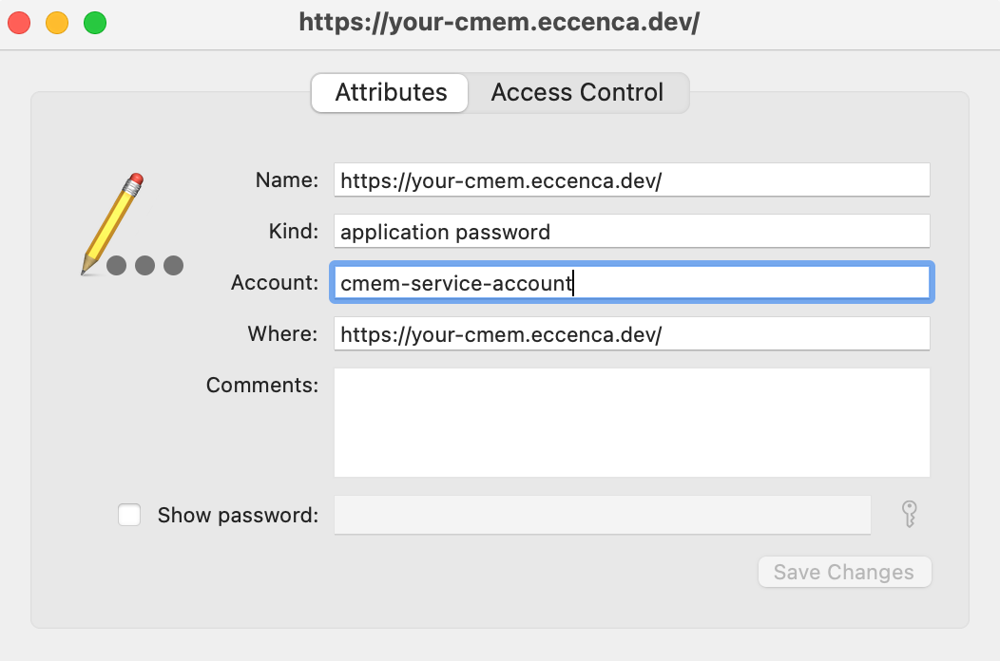

# Getting Credentials from External Processes (cmemc)

## Introduction

This page discusses how to avoid passwords in configuration files by using configured credential processes or environment variables.
This is especially needed when credentials change often and / or are stored in central infrastructure such as personal or company wide password managers.
In addition to that, you might find it useful when working with cmemc in CI/CD pipelines.

## Environment Variables

As described in the [Configuration with Environment Variables](../environment-based-configuration/index.md) document, cmemc can be configured with environment variables.
The following code snippet demonstrates behaviour:

``` shell-session
$ export CMEM_BASE_URI="https://your-cmem.eccenca.dev/"
$ export OAUTH_GRANT_TYPE="client_credentials"
$ export OAUTH_CLIENT_ID="cmem-service-account"
$ export OAUTH_CLIENT_SECRET="...secret..."
$ cmemc graph list
```

In the context of a CI/CD pipeline e.g. on github, these credentials can be taken from the repository secrets:

``` yaml
jobs:
  build:
    runs-on: ubuntu-latest
    steps:
      - uses: actions/checkout@v2
      - name: run cmemc
    env:
        CMEM_BASE_URI: https://your-cmem.eccenca.dev/
        OAUTH_GRANT_TYPE: client_credentials
        OAUTH_CLIENT_ID: cmem-service-account
        OAUTH_CLIENT_SECRET: ${{ secrets.OAUTH_CLIENT_SECRET }}
    run: |
            cmemc graph list
```

If in shell context, you can fetch the secret from an external process to the variable:

``` shell-session
$ export OAUTH_CLIENT_SECRET=$(get-my-secret.sh)
```

## External Processes

Another option, which is interesting when working with multiple Corporate Memory instances, is to configure an external process in your [cmemc configuration file](../file-based-configuration/index.md).

In order to get credential information from an external process, you need to use the following configuration variables to setup an external executable:

- `OAUTH_PASSWORD_PROCESS`, to setup the process to get the use password when using the `password` grant type.
- `OAUTH_CLIENT_SECRET_PROCESS`, to setup the process to get the client secret when using `client_credentials` grant type .
- `OAUTH_ACCESS_TOKEN_PROCESS`, to setup the process to get the direct access token (`prefetched_token`).

The credential executable can use the other cmemc environment keys of the configuration block for fetching the credential (e.g. `CMEM_BASE_URI` and `OAUTH_USER`).

If the credential executable is not given with a a full path, cmemc will look into your environment `PATH` for something which can be executed.

The configured process needs to return the credential on the first line of `stdout`. In addition to that, the process needs to exit with exit code 0 (without failure).

The following config section demonstrates this behaviour:

``` ini
[your-cmem]
CMEM_BASE_URI=https://your-cmem.eccenca.dev/
OAUTH_GRANT_TYPE=client_credentials
OAUTH_CLIENT_ID=cmem-service-account
OAUTH_CLIENT_SECRET_PROCESS=get-my-secret.sh
```

If you need to add options to the call, you can write the call as a list:

``` ini
[your-cmem]
CMEM_BASE_URI=https://your-cmem.eccenca.dev/
OAUTH_GRANT_TYPE=client_credentials
OAUTH_CLIENT_ID=cmem-service-account
OAUTH_CLIENT_SECRET_PROCESS=["getpass.sh", "parameter1", "parameter2"]
```

### Example: MacOS Keychain

Here is an working example with the MacOS Keychain, which can be queried with the command line tool `security`.

This example fetches a password for the account `cmem-service-account` on the service `https://your-cmem.eccenca.dev/`.

``` ini
OAUTH_CLIENT_SECRET_PROCESS=["security", "find-generic-password", "-w", "-a", "cmem-service-account", "-s", "https://your-cmem.eccenca.dev/" ]
```

The corresponding keychain entry looks like this:

{ width=80% }

In order to avoid repeating this long line in a cmemc configuration with lots of entries, this could be wrapped in a shell script like this:

``` bash
#!/usr/bin/env bash

if [ "${OAUTH_GRANT_TYPE}" = "client_credentials" ]; then
    security find-generic-password -w -a "${OAUTH_CLIENT_ID}" -s "${CMEM_BASE_URI}" || exit 1
    exit 0
fi
if [ "${OAUTH_GRANT_TYPE}" = "password" ]; then
    security find-generic-password -w -a "${OAUTH_USER}" -s "${CMEM_BASE_URI}" || exit 1
    exit 0
fi
exit 1
```

