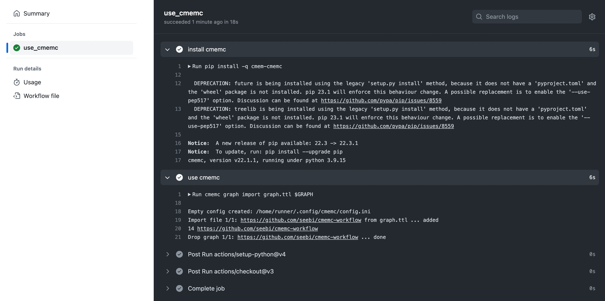

# Using Github Actions

## Introduction

Project teams often manage crucial parts of their work assets inside of git repositories.
This includes Corporate Memory related files such as ontologies, shapes or project configurations.
Given such a project setup, it is often wanted to automate activities with these Corporate Memory files.

[Github Actions](https://docs.github.com/en/actions) allow for automation and execution of workflows based on pushes, merge requests and other trigger events on your git repository.
In order to control eccenca Corporate Memory instances from within Github Action based workflows, you need to provide cmemc as well as credentials for your instance to the workflow.

## Runner Provisioning

Providing a working cmemc command is simple.
You just need to install a python environment suitable to run cmemc (currently `3.9`).
This can be done with the [setup-python](https://github.com/actions/setup-python) action.
After that, simply use `pip` to install cmemc:

```yaml title="Partial github action yaml showing cmemc provisioning"
      - uses: actions/setup-python@v4
        with:
          python-version: '3.9'
      - name: install cmemc
        run: |
          pip install -q cmem-cmemc
          cmemc --version
```

Adding this to your workflow yaml description, will provide a cmemc command which can be used in all following steps of the same workflow.

## Credentials and Usage

Since we should never save credentials in your repository, we need to provide them as an encrypted secret managed outside of the repository.
Github provides you with an [Encrypted Secrets](https://docs.github.com/en/actions/security-guides/encrypted-secrets) interface where you can add secrets for your repository, which then can be used in your workflows.

Given the following workflow step, you need to add `MY_CMEM_BASE_URI`, `MY_OAUTH_GRANT_TYPE`, `MY_OAUTH_CLIENT_ID` and `MY_OAUTH_CLIENT_SECRET` as encrypted secrets to your repository:

```yaml title="Partial github action yaml showing credential provisioning"
      - name: use cmemc
        run: |
          cmemc graph import graph.ttl $GRAPH
          cmemc graph count $GRAPH
          cmemc graph delete $GRAPH
        env:
          GRAPH: "https://github.com/eccenca/cmemc-workflow"
          CMEM_BASE_URI: ${{ secrets.MY_CMEM_BASE_URI }}
          OAUTH_GRANT_TYPE: ${{ secrets.MY_OAUTH_GRANT_TYPE }}
          OAUTH_CLIENT_ID: ${{ secrets.MY_OAUTH_CLIENT_ID }}
          OAUTH_CLIENT_SECRET: ${{ secrets.MY_OAUTH_CLIENT_SECRET }}
```

This snippet also demonstrates, how you can map your encrypted secrets to [cmemc's configuration variables](../cmemc-command-line-interface/configuration/file-based-configuration).

## Example Project

The Github project [eccenca/cmemc-workflow](https://github.com/eccenca/cmemc-workflow) provides an [example workflow description](https://github.com/eccenca/cmemc-workflow/blob/main/.github/workflows/cmemc.yml) which uses cmemc to import a graph, count the triples and removes the graph afterwards.
Here is an example output:



