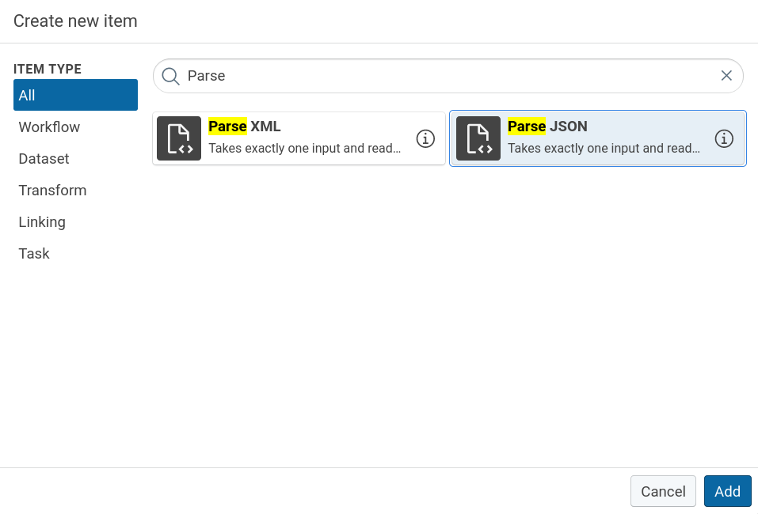
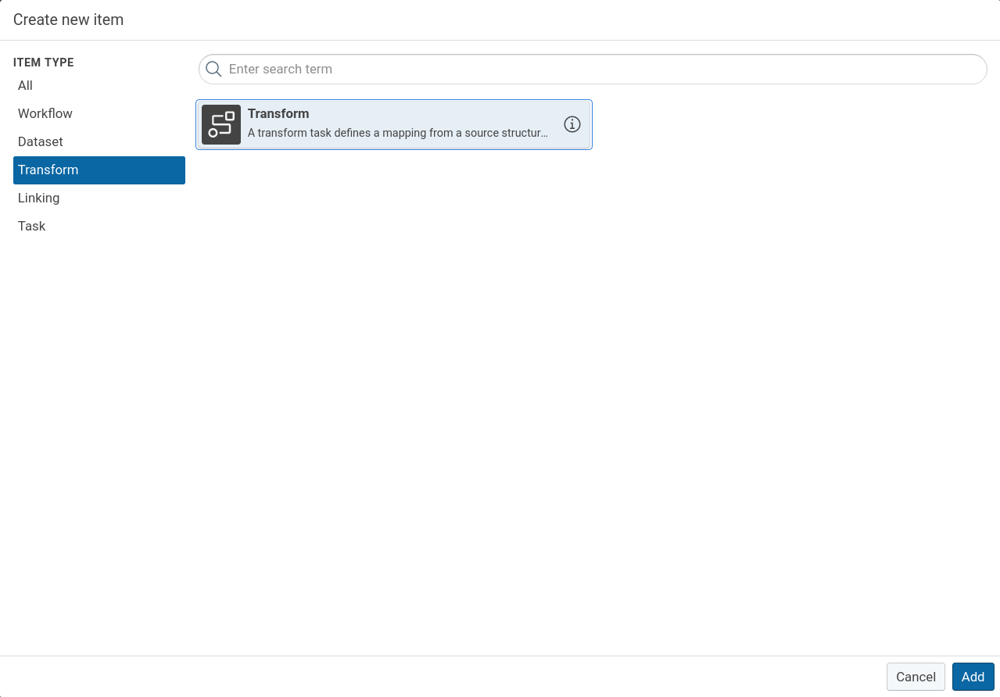
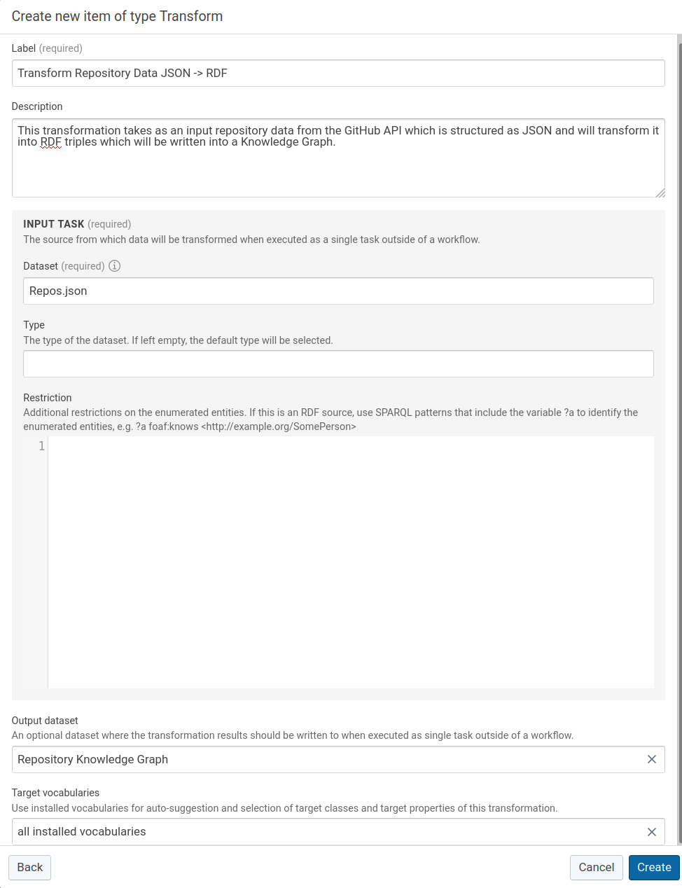
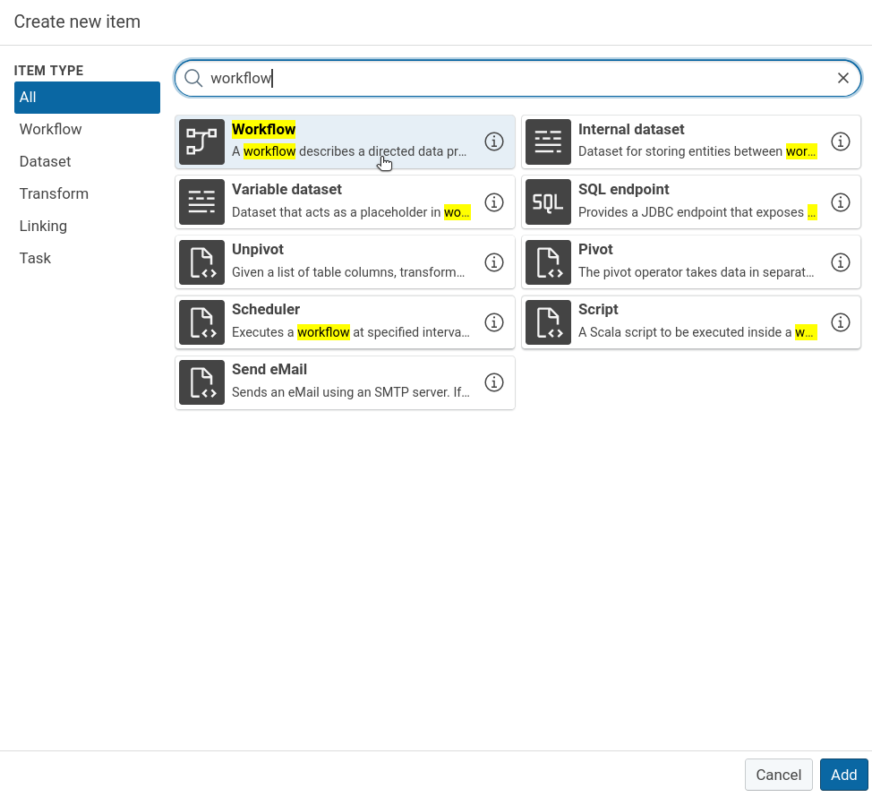
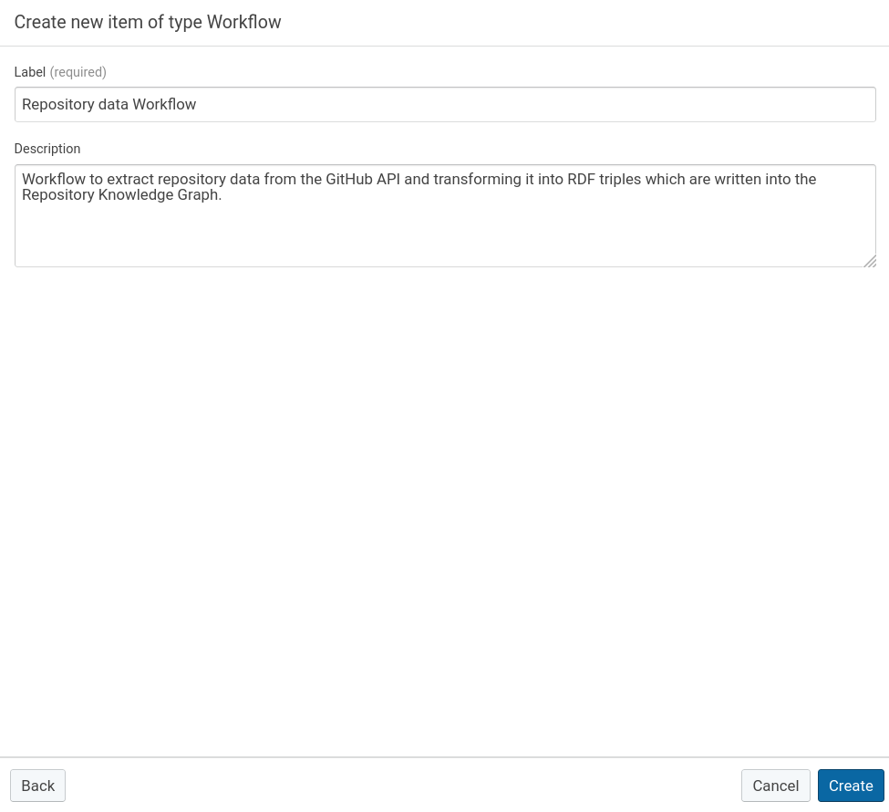
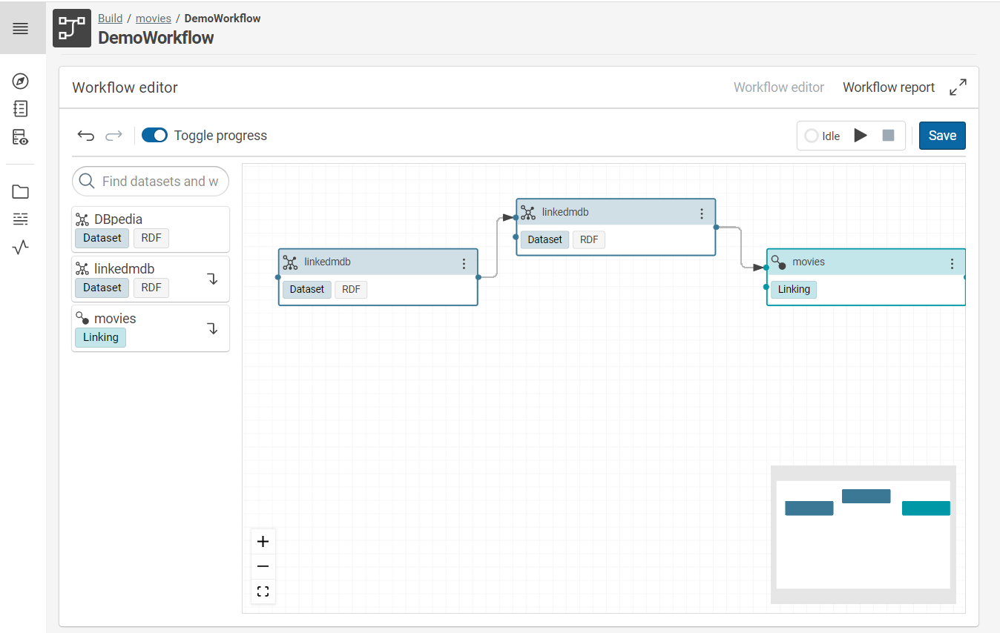

# Extracting data from a Web API

## Introduction

This tutorial demonstrates how you can build a Knowledge Graph based on input data from a Web API.
The tutorial is based on the [GitHub API (v3)](https://developer.github.com/v3/), which we will use to fetch repository data of a certain organization and create a Knowledge Graph from the response.

!!! info

    The complete tutorial is available as a [project file](tutorial-webapi.project.zip). You can import this project:

    - by using the [web interface](../introduction-to-the-user-interface/index.md) (Create → Project → Import project file) or
    - by using the [command line interface](../../automate/cmemc-command-line-interface/index.md)

    ``` shell-session
    $ cmemc -c my-cmem project import tutorial-webapi.project.zip web-api
    ```

In order to get familiar with the API, simply fetch an example response with this command:

``` shell-session
$ curl https://api.github.com/orgs/vocol/repos
```

The HTTP Get request retrieves all repositories of a GitHub organization named vocol.

The JSON response includes the data for all repositories (**mobivoc**, **vocol**, ...). You can also download the response file here: [repos.json](repos.json).

``` json
[
    {
        ...
        "id": 22646219,
        "name": "mobivoc",
        ...
    },
    {
        ...
        "id": 22646629,
        "name": "vocol",
        ...
    },
    {
        ...
        "id": 30964669,
        "name": "scor",
        ...
    },
    ...
]
```

## 1 Register a Web API

1. Click the **Create** button (top right) in the data integration workspace and select the type **REST request**.

    

2. Define a **Label, Description** and the **URL** of the Web API. Example input: `https://api.github.com/orgs/vocol/repos`.

    

## 2 Create a JSON parser

As we are only interested in the _HTTP Message Body_ which holds the JSON repository data, we first have to parse the _body_ from the entire HTTP response.

1. Click the **Create** button (top right) in the data integration workspace and select the type **Parse JSON.**

    

2. Define a **Label**, a **Description**, and the **Input path.** All other fields can keep the default settings. The default input path is always: `<http://silkframework.org/vocab/taskSpec/RestTaskResult/responseBody>`

    

## 3 Create a JSON Dataset

To create a JSON-to-RDF-mapping within Corporate Memory, we have to first register an example response from the API (repos.json). Based on the schema of the response, we can then define step-by-step the mappings, which are used to build the Knowledge Graph.

1. Click the **Create** button (top right) in the data integration workspace and select the type **JSON**.

    

2. Upload the JSON file [repos.json](repos.json) (API response) as a Dataset into Corporate Memory.

    

## 4 Create a Knowledge Graph

The Knowledge Graph will be used to integrate all data coming from one or more APIs. The Knowledge Graph receives RDF triples from the defined Transformations for each API.

1. Click the Create button (top right) in the data integration workspace and select the type **Knowledge Graph**.

    

2. Provide the Knowledge Graph with a **Label** and **Description**, as well as the following (example) **Graph** URI: `http://ld.company.org/repository-data/`

    

## 5 Create a Transformation

In order to transform the input data from the API, in our example structured in JSON, we have to define a mapping to create RDF triples which are then written to the Knowledge Graph.

1. Click the Create button (top right) in the data integration workspace and select the type **Transform**.

    

2. Provide the Transformation with a **Label** and **Description**, configure the **Input Dataset** (Repos.json) and the **Output Dataset** (Repository Knowledge Graph).

    

3. Click the **Mapping Editor** button in the previously defined Transformation.

    

4. In the following screenshots, we provide an example mapping for the data received by the GitHub API. For more complex mappings, we recommend the Tutorial [Lift data from JSON and XML sources](../lift-data-from-json-and-xml-sources/index.md).

    

    

## 6 Create a Workflow

To build a workflow that combines all the elements we previously built, we now define a workflow for (1) requesting the data from the GitHub API, (2) parsing the HTTP response we receive, (3) transforming the JSON data into RDF triples and finally (4) writing the RDF triples into the Knowledge Graph.

1. Click the **Create** button (top right) in the data integration workspace and select the type **Workflow**.

    

2. Provide the Transformation with a **Label** and a **Description**.

    

3. Click the **Workflow Editor** button in the menu of the created workflow.

    

4. Drag and drop the different items into the Workflow Editor and combine them with one another (see example screenshot). **Save** the workflow, and press the **run symbol** to execute the workflow.

    

5. Validate the result by clicking on the **Workflow** **Report** tab and see the result of your execution. In this example, 15x repositories were found from the GitHub API request.

    

