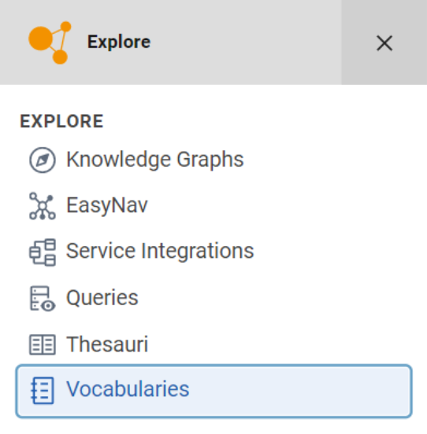

---
tags:
  - AdvancedTutorial
---
# Lift data from JSON and XML source

## Introduction

This tutorial shows how you can build a Knowledge Graph based on input data from hierarchical sources like a **JavaScript Object Notation** file (.json) or an **Extensible Markup Language** file (.xml).

!!! info

    The complete tutorial is available as a [project file (XML)](tutorial-xml.project.zip) and a [project file (JSON)](tutorial-json.project.zip). You can import these projects:

    - by using the [web interface](/build/introduction-to-the-user-interface) (Create → Project → Import project file) or
    - by using the [command line interface](/automate/cmemc-command-line-interface)

        ```shell
        cmemc -c my-cmem project import tutorial-xml.project.zip xml-transformation
        ```

        ```shell
        cmemc -c my-cmem project import tutorial-json.project.zip json-transformation
        ```

The documentation  consists of the following steps, which are described in detail below:

The following material is used in this tutorial:

- Sample vocabulary which describes the data in the JSON and XML files: [products_vocabulary.nt](products_vocabulary.nt)

    

- Sample JSON file: [services.json](services.json)

    ```json
    [
        {
            "Price": "748,40 EUR",
            "ProductManager": "Lambert.Faust@company.org",
            "Products": "O491-3823912, I965-1821441, Z655-3173353, ...",
            "ServiceID": "Y704-9764759",
            "ServiceName": "Product Analysis"
        },
        {
            "Price": "1082,00 EUR",
            "ProductManager": "Corinna.Ludwig@company.org",
            "Products": "Z249-1364492, L557-1467804, C721-7900144, ...",
            "ServiceID": "I241-8776317",
            "ServiceName": "Component Confabulation"
        },
        ...
    ]
    ```

- Sample XML file: [orgmap.xml](orgmap.xml)
    ```xml
    <orgmap>
        <dept id="73191" name="Engineering">
            <manager>
                <email>Thomas.Mueller@company.org</email>
                <name>Thomas Mueller</name>
                <address>Karl-Liebknecht-Straße 885, 82003 Tettnang</address>
                <phone>+49-8200-38218301</phone>
            </manager>
            <employees>
                <employee>
                    <email>Corinna.Ludwig@company.org</email>
                    <name>Corinna Ludwig</name>
                    <address>Ringstraße 276</address>
                    <phone>+49-1743-24836762</phone>
                    <productExpert>Memristor, Gauge, Encoder</productExpert>
                </employee>
                <employee>
                    <email>Karen.Brant@company.org</email>
                    <name>Karen Brant</name>
                    <address>Friedrichstraße 664, 30805 Willich</address>
                    <phone>(00530) 5040048</phone>
                    <productExpert>Inductor</productExpert>
                </employee>
                ...
            </employees>
            <products>
                <product id="Z249-1364492" />
                <product id="O184-6903943" />
                <product id="V404-9975399" />
                <product id="F344-7012314" />
                <product id="N463-8050264" />
                <product id="M605-5951566" />
                <product id="N733-1946687" />
            </products>
            <services>
                <service id="I241-8776317" />
                <service id="D215-3449390" />
            </services>
        </dept>
        <dept id="22183" name="Product Management">        
            ...
        </dept>
        ...
    </orgmap>
    ```

## 1 Register the vocabulary

The vocabulary contains the classes and properties needed to map the source data into entities in the Knowledge Graph.

1. In Corporate Memory, click **Vocabularies** in the under **EXPLORE** in the navigation on the left side of the page.

    {width="30%"}

2. Click **Register new vocabulary** on the top right of the **Vocabulary catalog** page in Corporate Memory.

    

3. Define a **Name**, a **Graph URI** and a **Description** of the vocabulary. _In this example we will use:_

    - Name: _**Product Vocabulary**_
    - Graph URI: _**http://ld.company.org/prod-vocab/**_
    - Description: _**Example vocabulary modeled to describe relations between products and services.**_

    {width="50%"}

4. Click **REGISTER**.

## 2 Upload the data file

To add the data files, click Projects under BUILD in the navigation on the left side of the page. Follow the steps below for adding JSON and XML datasets.

### JSON

1. Click **Create** at the top of the page.
2. In **Create new item** window, select **JSON** and click Add.

    

3. Define a **Label** for the dataset and upload the [services.json](services.json) file. You can leave all the other fields at default values.

    {width="45%"} {width="45%"}

4. Click **Create**.
