---
tags:
  - BeginnersTutorial
---
# Lift data from tabular data such as CSV, XSLX or database tables

## Introduction

This beginner-level tutorial shows how you can build a Knowledge Graph based on input data from a **comma-separated value file** (.csv), an **excel file** (.xlsx) or a **database table** (jdbc).

!!! info

    The complete tutorial is available as a [project file](tutorial-csv.project.zip). You can import this project

    - by using the [web interface](/build/introduction-to-the-user-interface) (Create → Project → Import project file) or
    - by using the [command line interface](/automate/cmemc-command-line-interface)

    ``` shell-session
    $ cmemc -c my-cmem project import tutorial-csv.project.zip tutorial-csv
    ```

    This step is optional and makes some of the following steps of the tutorial superfluous.

The documentation consists of the following steps, which are described in detail below:

1. Registration of the target vocabulary
2. Uploading of the data (file)/Connect to JDBC endpoint
3. (Re-)View your data table
4. Creation of a (target) graph
5. Creation of the transformation rules
6. Evaluation of the results of the transformation rules
7. Execution of the transformation to populate the target graph

## Sample Material

The following material is used in this tutorial, you should download the files and have them at hand throughout the tutorial:

- Sample vocabulary which describes the data in the CSV files: [products_vocabulary.nt](products_vocabulary.nt)

    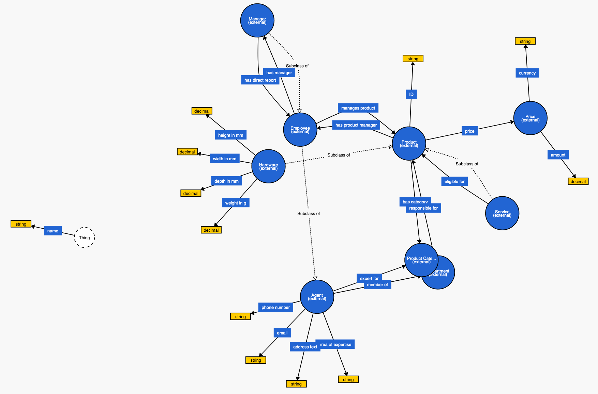

- Sample CSV file: [services.csv](services.csv)

    !!! info

        | ServiceID    | ServiceName             | Products                                      | ProductManager             | Price       |
        | ------------ | ----------------------- | --------------------------------------------- | -------------------------- | ----------- |
        | Y704-9764759 | Product Analysis        | O491-3823912, I965-1821441, Z655-3173353, ... | Lambert.Faust@company.org  | 748,40 EUR  |
        | I241-8776317 | Component Confabulation | Z249-1364492, L557-1467804, C721-7900144, ... | Corinna.Ludwig@company.org | 1082,00 EUR |
        | …            | …                       | …                                             | …                          | …           |

- Sample Excel file: [products.xlsx](products.xlsx)

    !!! info

        | ProductID    | ProductName        | Height | Width | Depth | Weigth | ProductManager              | Price    |
        | ------------ | ------------------ | ------ | ----- | ----- | ------ | --------------------------- | -------- |
        | I241-8776317 | Strain Compensator | 12     | 68    | 15    | 8      | Baldwin.Dirksen@company.org | 0,50 EUR |
        | D215-3449390 | Gauge Crystal      | 77     | 58    | 19    | 15     | Wanja.Hoffmann@company.org  | 2,00 EUR |
        | …            | …                  | …      | …     | …     | …      | …                           | …        |

---

## 1 Register the vocabulary

The vocabulary contains the classes and properties needed to map the data into the new structure in the Knowledge Graph.

=== "Corporate Memory"

    1. In Corporate Memory, click Vocabularies under **EXPLORE** in the navigation on the left side of the page.

        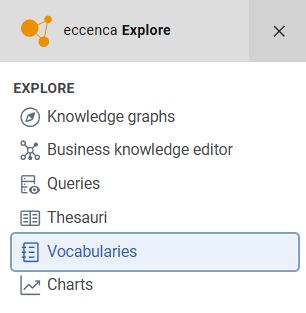{width="30%"}

    2. Click **Register new vocabulary** on the top right.

        

    3. Define a **Name**, a **Graph URI** and a **Description** of the vocabulary. _In this example we will use:_

        - Name: _**Product Vocabulary**_
        - Graph URI: _**http://ld.company.org/prod-vocab/**_
        - Description: _**Example vocabulary modeled to describe relations between products and services.**_
        - Vocabulary File: Browse in your filesystem for the **[products_vocabulary.nt](products_vocabulary.nt)** file and select it to be uploaded.

        {width="50%"}

=== "cmemc"

    ``` shell-session
    $ cmemc vocabulary import products_vocabulary.nt
    ```

---

## 2 Upload the data file / Connect to the JDBC endpoint

=== "CSV + XLSX"

    1. In Corporate Memory, click Projects under **BUILD** in the navigation on the left side of the page.

        {width="30%"}

    2. Click **Create** at the top of the page. 

    3. In **Create new item** window, select **Project** and click **Add**. The Create new item of type Project window appears.  

    4. Fill in the required details such as Title and Description. Alternatively, import the existing project by clicking **Import Project File** and selecting the file from your system.  

    5. Click **Create**. Your project is created.

    6. Within your project, click **Create** or **Create item**.

    7. In the **Create new item** dialog, select **CSV**.

        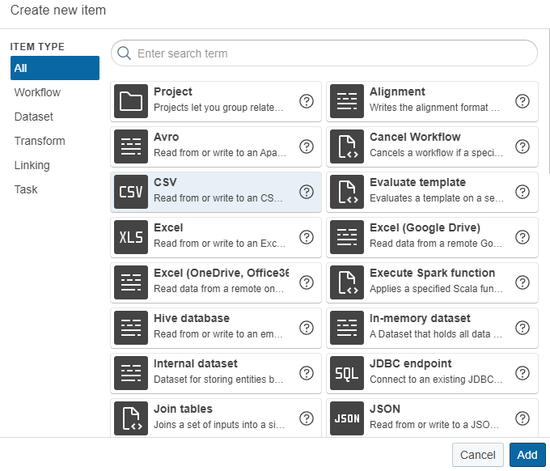

    8. Fill out a label and upload the **[services.csv](services.csv) sample file**.

        

    9.  Click **Create**.** Leave all other parameters at their default values.

    10. Create a second **dataset**. Choose **Excel** and upload the [products.xlsx](products.xlsx) file.

=== "JDBC"

    Instead of uploading the [services.csv](services.csv) sample file into Corporate Memory, you can also load it into a SQL database and access it from Corporate Memory using the JDBC protocol.

    1. In the project, Click **Create** and select the **JDBC endpoint** type.

        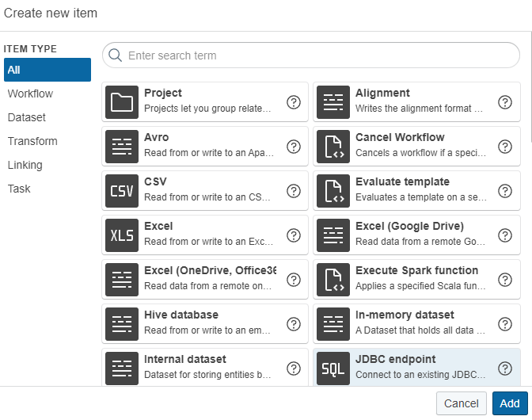

    2. Define a **Label** for the dataset, specify the **JDBC Driver connection URL**, the **table** name and the **user** and **password** to connect to the database. _In this example we will use:_

        - Name: _**Services_ServiceDB**_
        - JDBC Driver Connection URL: _**jdbc:mysql://mysql:3306/ServicesDB**_
        - table: _**Services**_
        - username: _**root**_
        - password: _**\*\*\*\***_

        

        The general form of the JDBC connection string is:

        ```
        jdbc:<vendor>://<hostname>:<portNumber>/<databaseName>
        ```

        Default JDBC connection strings for popular Relational Database Management Systems:

        | Vendor               | Default JDBC Connection String                  | Default Port |
        | -------------------- | ----------------------------------------------- | ------------ |
        | Microsoft SQL Server | jdbc:sqlserver:<hostname>:1433/<databaseName>   | 1433         |
        | PostgreSQL           | jdbc:postgresql:<hostname>:5432/<databaseName>  | 5432         |
        | MySQL                | jdbc:mysql:<hostname>:3306/<databaseName>       | 3306         |
        | MariaDB              | jdbc:mariadb:<hostname>:3306/<databaseName>     | 3306         |
        | IBM DB2*             | jdbc:db2:<hostname>:50000/<databaseName>        | 50000        |
        | Oracle*              | jdbc:oracle:thin:<hostname>:1521/<databaseName> | 1521         |

        !!! info

            \* IBM DB2 and Oracle JDBC drivers are not by default part of Corporate Memory, but can be added.

        !!! info

            Instead of selecting a table you can also specify a custom SQL query in the _source query_ field.

=== "cmemc"

    ``` shell-session
    $ cmemc project create tutorial-csv

    $ cmemc dataset create --project tutorial-csv services.csv

    $ cmemc dataset create --project tutorial-csv products.xlsx
    ```

---

## 3 (Re-)View your Data Table

To validate that the input data is correct, you can preview the data table in Corporate Memory.

1. On the dataset page, press the **Load preview** button

    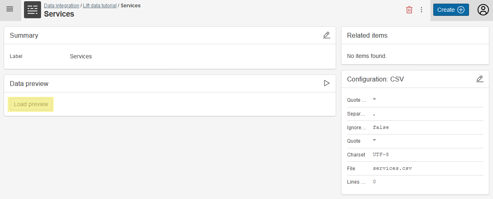

2. Once the preview is loaded, you can view a couple of rows to check that your data is accessible.

    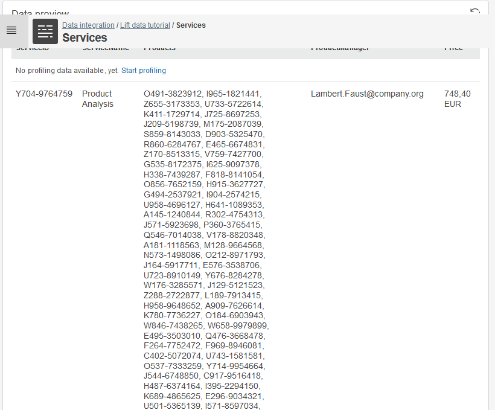

3. Optionally, you can click **start profiling** and explore statistics about the dataset.

    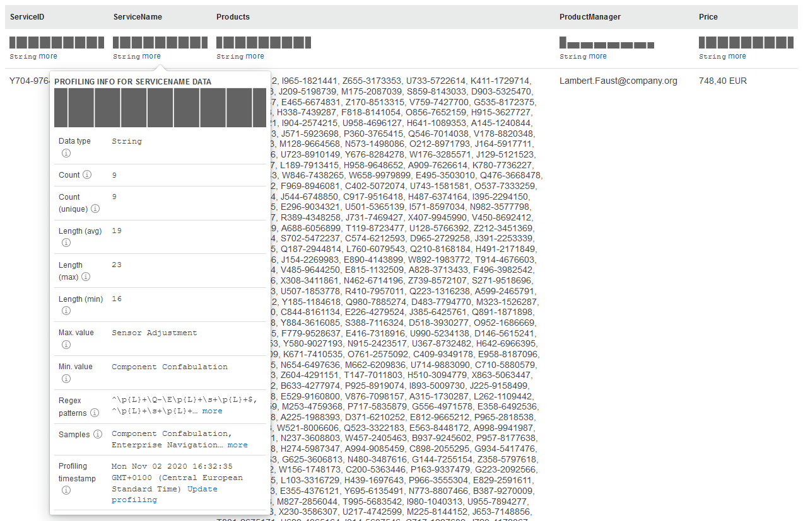

---

## 4 Create a Knowledge Graph

1. Click Create at the top of the page.

2. In Create new item window, select Knowledge Graph and click Add.

    

3. The Create new item of type Knowledge Graph window appears.

4. Define a **Label** for the Knowledge Graph and provide a **graph** uri. Leave all the other parameters at the default values. _In this example we will use:_

    - Label: _**Service Knowledge Graph**_
    - Graph: _**http://ld.company.org/prod-instances/**_

5. Click **Create**.

---

## 5 Create a Transformation

The transformation defines how an input dataset (e.g. CSV) will be transformed into an output dataset (e.g. Knowledge Graph).

1. Click **Create** in your project.  

2. On the **Create New Item** window, select **Transform** and click **Add** to create a new transformation.

3. Fill out the the details leaving the **target vocabularies** field at its default value **all installed vocabularies,** which will enable us to create a transformation to the previously installed products vocabulary. _In this example we will use:_

    - Name: _**Lift Service Database**_
    - _In the section **INPUT TASK** in the field **Dataset**, select the previously created dataset: **Services** (Input Dataset)._
    - _Select the previously created dataset as the Output Dataset: **Service Knowledge Graph**_

4. In the main area you will find the **Mapping editor**.

    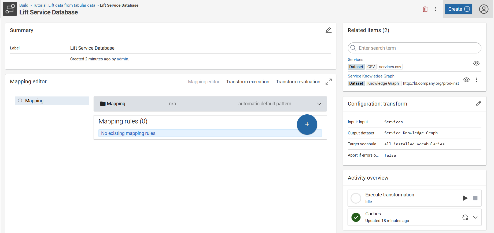

5. Click **Mapping** in the main area to expand its menu.

    

6. Click **Edit** to create a base mapping.

    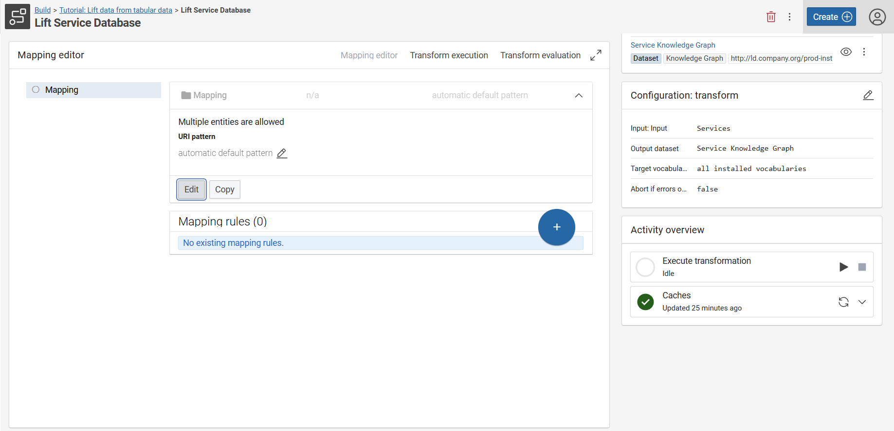

7. Define the **Target entity type** from the vocabulary, the **URI pattern** and a **label** for the mapping. _In this example we will use:_

    - Target entity type: _**Service**_
    - URI pattern:

        - Click **Create custom pattern**
        - Insert _**http://ld.company.org/prod-inst/{ServiceID}**_
        - where _http://ld.company.org/prod-inst/_ is a common prefix for the instances in this use case,
        - and _{ServiceID}_ is a placeholder that will resolve to the column of that name

    - _An optional Label: **Service**_

    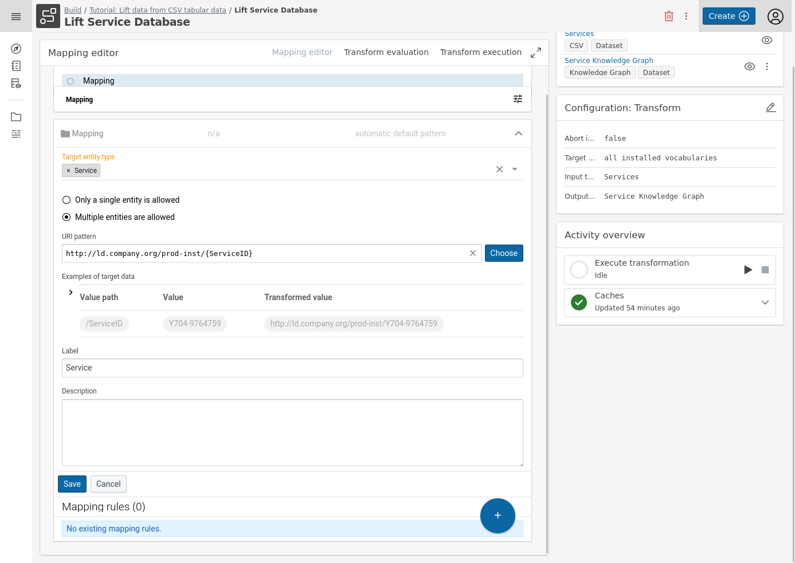

8. Click **Save** _Example RDF triple in our Knowledge Graph based on the mapping definition:_

    ```nt
    <http://ld.company.org/prod-inst/Y704-9764759> <http://www.w3.org/1999/02/22-rdf-syntax-ns#type> <http://ld.company.org/prod-vocab/Service>
    ```

9. Evaluate your mapping by clicking the Expand  button in the **Examples of target data** property to see at most three generated base URIs.

    

    We have now created the Service entities in the Knowledge Graph. As a next step, we will add the name of the Service entity.

10. Press the circular **Blue + button** on the lower right and select **Add value mapping**.

    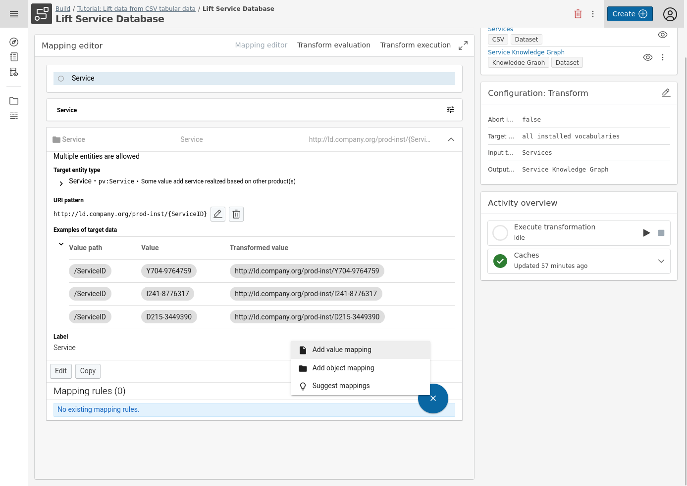

11. Define the **Target property**, the **Data type**, the **Value path** (column name) and a **Label** for your value mapping. _In this example we will use:_

    - Target Property: **_name_**
    - Data type: _**StringValueType**_
    - Value path: _**ServiceName**_ (which corresponds to the column of that name)
    - An optional Label: _**service name**_

    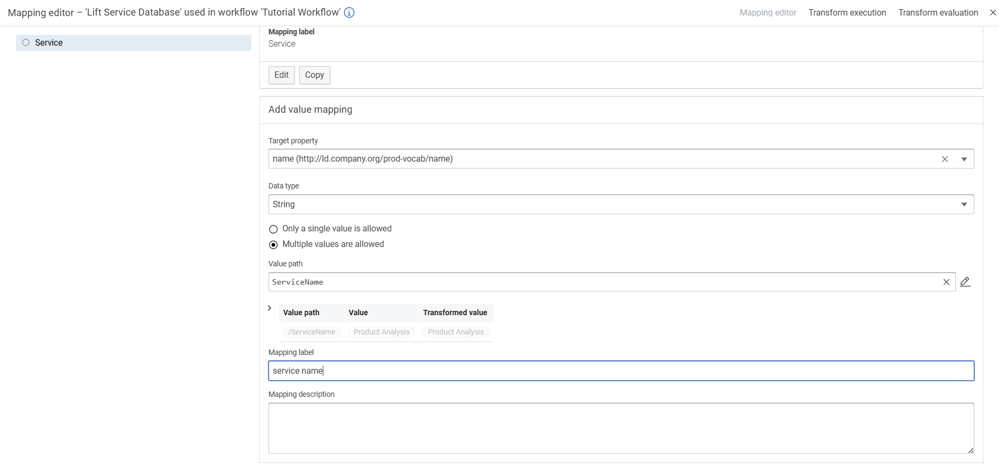

12. Click **Save.**

---

## 6 Evaluate a Transformation

Go the **Transform evaluation** tab of your transformation to view a list of generated entities. By clicking one of the generated entities, more details are provided.


---

## 7 Build the Knowledge Graph

1. Go into the mapping and visit the **Transform execution** tab.

    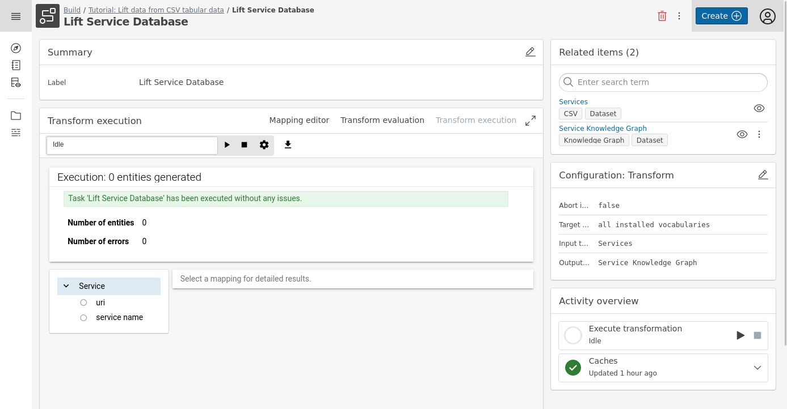

2. Press the  button and validate the results. In this example, 9x Service triples were created in our Knowledge Graph based on the mapping.

    

3. Finally you can use the DataManager **Knowledge Graphs** module to (re-)view of the created Knowledge Graph: http://ld.company.org/prod-instances/

    
