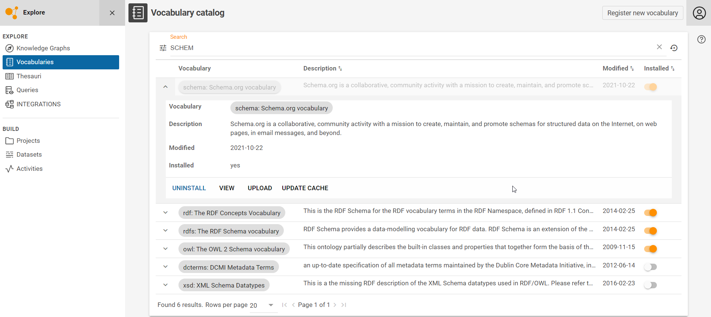
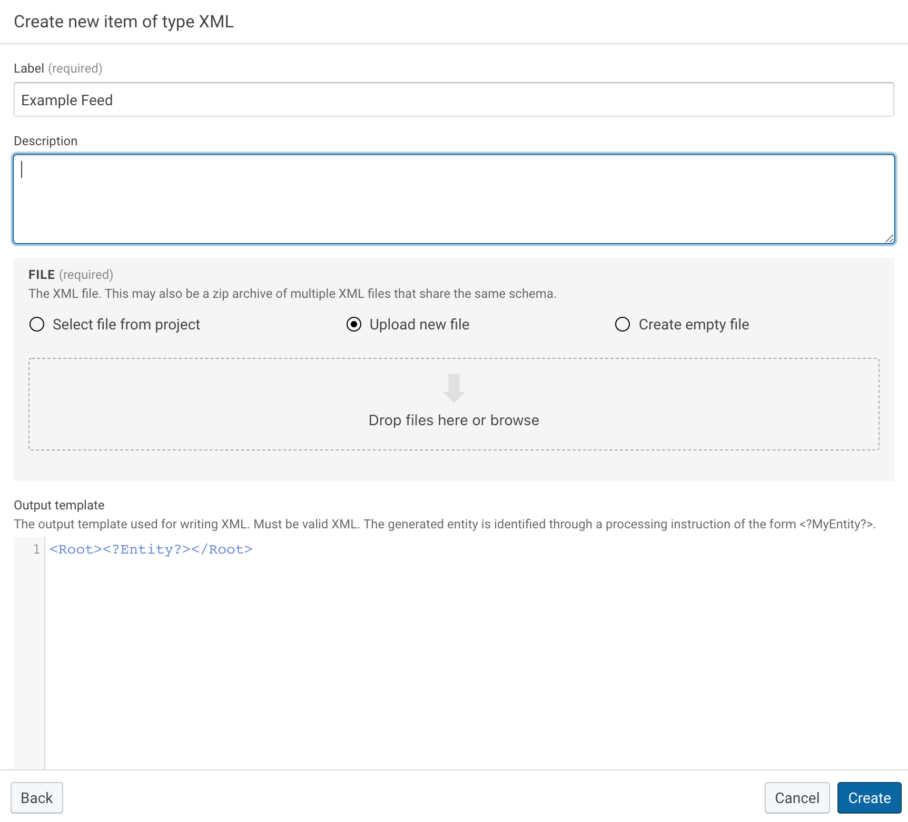
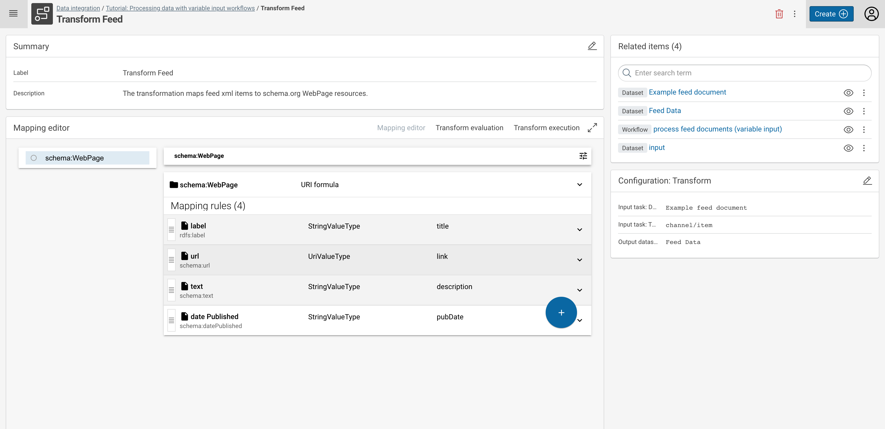

---
tags:
  - ExpertTutorial
  - Automate
  - Workflow
  - cmemc
---
# Processing Data with Variable Input Workflows

## Introduction

This tutorial shows how you can create and use data integration workflows to process data coming from outside Corporate Memory (means, without registering datasets).
The concept to achieve this is named a **Variable Dataset**.
A variable dataset is created and used inside of a workflow as an input for other tasks (e.g. a transformation) at the place where a "normal" dataset (such as register CSV file) would be placed.

The workflow is then called via an HTTP REST call (or via [cmemc](/automate/cmemc-command-line-interface)), thus uploading the payload data "at the place" of this variable input dataset and executing all following parts of the workflow.

This allows for solving all kinds of [☆ Automation](/automate) tasks when you need to process lots of small data snippets or similar.

!!! info

    The complete tutorial is available as a [project file](tutorial-varinput.project.zip). You can import this project

    - by using the [web interface](/build/introduction-to-the-user-interface) (Create → Project → Import project file) or
    - by using the [command line interface](/automate/cmemc-command-line-interface)

        ``` shell-session
        $ cmemc -c my-cmem project import tutorial-varinput.project.zip varinput
        ```

## 1 Install the required vocabularies

First, install all required ontologies/vocabularies which are needed for mappings later in the tab **VOCABULARIES.**

In this tutorial, we need the _Schema.org_ and the _RDFS_ vocabulary. Press the (toggle switch) button on the right to install them.



## 2 Create a new project

Second, create in the tab **DATA INTEGRATION** a new project. Provide it with a _Title_ and _Description_.

The project will include everything you need to build a workflow for extracting Feed XML data, transforming it into RDF, and loading it into a Knowledge Graph.


## 3 Create an (example) feed dataset and target graph dataset

Upload a sample XML dataset (feed data) into your project: Create → XML → Upload new file.

For this tutorial, you may take this file: [feed.xml](feed.xml)(1)
{ .annotate }

1. Original feed source was: `https://www.ecdc.europa.eu/en/taxonomy/term/2942/feed`



## 4 Create the feed transformation

Based on the added sample feed XML Dataset, create a mapping to generate RDF triples.
The screenshot provides an example mapping to generate WebPages, which include a label, a URL, a text, and the date they were published in the feed.
The mappings are based on classes and properties defined by the _Schema.org_ and _RDFS_ vocabulary.

In case you need help with mapping data from XML to RDF, feel free to visit your respective tutorial: [Lift data from JSON and XML sources](/build/lift-data-from-json-and-xml-sources).



## 5 Create the variable input and workflow

Create a new workflow in your project.
Move the **input** XML feed dataset and the **Feed Data** Graph into the workflow editor and connect them with your created **Transform feed**.


## 6 Use `cmemc` to feed data into the workflow

Finally, you can process all the feeds you want, by executing the created workflow with a dynamic XML payload.

For this, you need to use the `workflow io` command:

``` shell-session
# process one specific feed xml document
$ cmemc workflow io varinput:process-feed -i feed.xml
```

You can easily automate this for a [list of feeds](feeds.txt) like this:

``` shell-session
$ cat feeds.txt
https://feeds.npr.org/500005/podcast.xml
http://rss.cnn.com/rss/cnn_topstories.rss
https://lifehacker.com/rss
http://feeds.bbci.co.uk/news/rss.xml
…

# fetch the list of urls one by one and feed the content to the corporate memory workflow
$ cat feeds.txt | xargs -I % sh -c '{ echo %; curl -s % -o feed.xml; cmemc workflow io varinput:process-feed -i feed.xml; rm feed.xml; }'
https://feeds.npr.org/500005/podcast.xml
http://rss.cnn.com/rss/cnn_topstories.rss
https://lifehacker.com/rss
http://feeds.bbci.co.uk/news/rss.xml
…
```

## 7 Explore the fetched Knowledge Graph

In **EXPLORATION**, you can study the ingested feed data in your Knowledge Graph.


