# **Snowflake**

## **Introduction**

Eccenca Corporate Memory is a semantic data management platform that allows organizations to store, manage, and interconnect vast amounts of structured and unstructured data.

Snowflake is a cloud-based data warehousing solution that provides a scalable and flexible platform for data storage and analysis. 

The eccenca Corporate Memory platform can connect to Snowflake to take advantage of Snowflake’s scalability and flexibility for data warehousing solutions. This connection allows organizations to store and manage large amounts of data in Snowflake while using eccenca Corporate Memory to link and interconnect with other data sources, such as databases and cloud applications, to form a comprehensive and unified view of all data assets.

By integrating Snowflake with eccenca Corporate Memory, organizations can achieve a centralized and unified data management system that allows them to gain a complete and accurate view of all their data assets. This integration enables organizations to make informed decisions, improve their business processes, and drive growth and innovation by leveraging their data assets. 

Step-by-step instructions to connect the Snowflake database with eccenca corporate memory:

## **1.Configure Custom JDBC Driver**.

To connect to Snowflake cloud data warehouse a JDBC driver is required. 

## **2.Create a database in snowflake**.

- Login to Snowflake enter the **username** and **password**, then click on **sign in**.


- Click on **Database** on the left side of the page.


- Click on **+Database** on the right side of the page.


- Type the database name **Product**, then click on **create**.

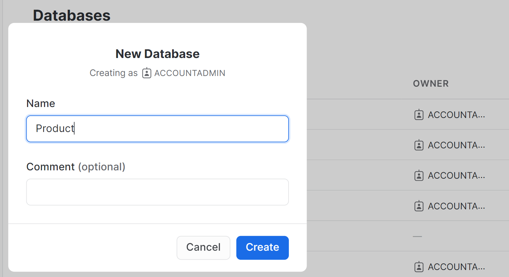

- Click on database **product**, then click on **+Schema** on the right side of the page.


- Type the schema name **products_vocabulary** and click on **create**.


- Click on scheme **products_vocabulary** on the left side of the page. 


- Click on **create**, then click on **table**, then select the **standard**.

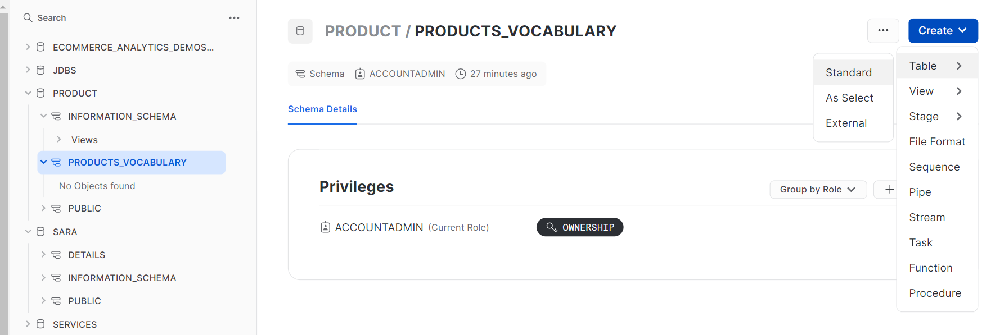

- Click on schema name **products_vocabulary** on the left side of the page and type the  **sql query** for creating a table in the center, then click on **Run** on the right side of the page.

!!! Example SQL Query

    CREATE TABLE PRODUCT (
    Product ID INT ,
    product_name VARCHAR(50) NOT NULL,
    Height INT ,
    Width INT ,
    Depth INT ,
    Weight INT ,
    Email VARCHAR(100) NOT NULL,
    Price INT,
    );


**Step Result** : The table is created as shown below.


- Type the **SQL** query for creating a database in the table that is created, then click on **Run**.

!!!  Example of a query for the database.
      
      INSERT INTO product (product_id, product_name, product_manager_name, email, price, height, width, depth, weight) 

      VALUES 
     (11,'Memristor Encoder','Siglind.Brinkerhoff','Siglind.Brinkerhoff Company.org','3,79 EUR',30,22,19,2).


**Step Result** : The database has been created as shown below.

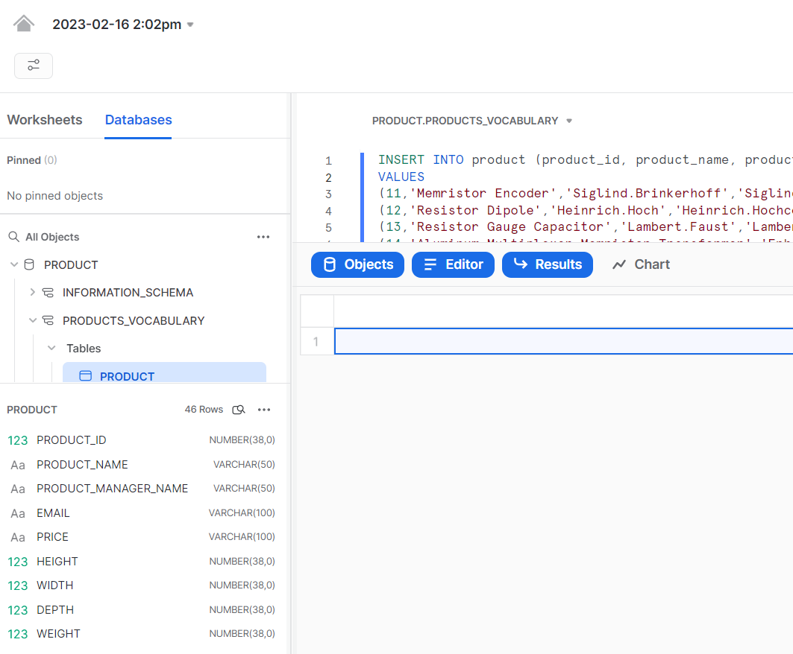

## **3. Create a project in eccenca Corporate Memory.**

- Click on **create** on the right side of the page.


- Click on Project, then click on **add**.


- Type the project name **product** in the title field, then click on **create**.


- Click on **create** on the right side of the page.


- Click on **JDBC endpoint**, then click on **add**.

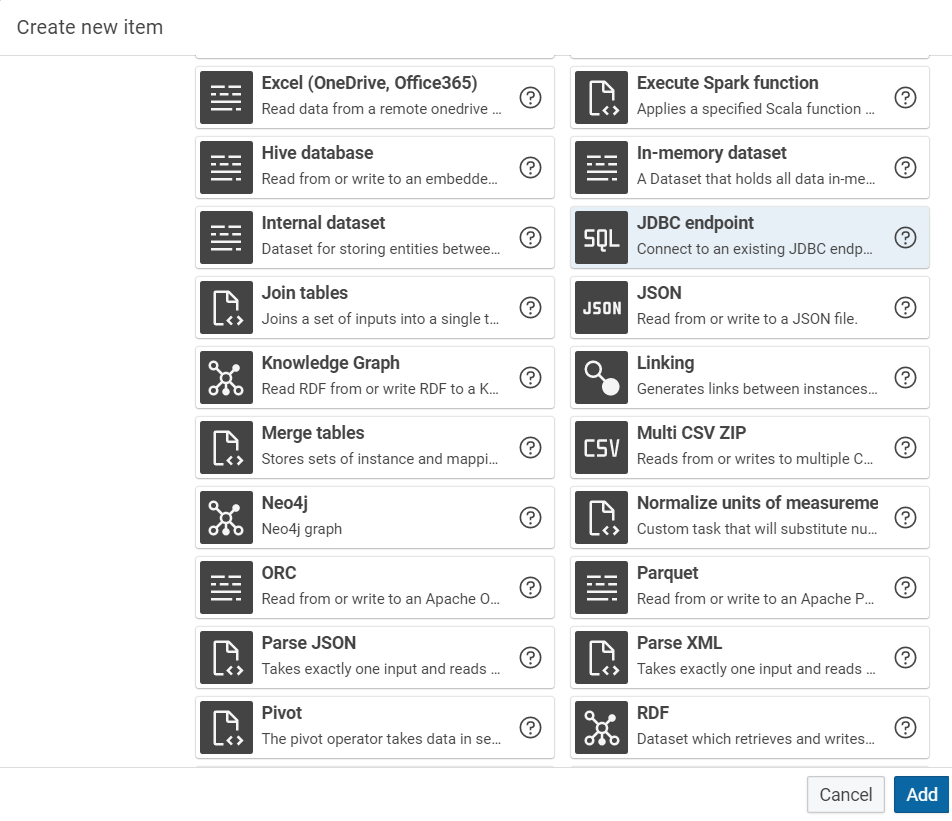

- Type the name **product table (JDBC)** in the label field.


- Type the **JDBC URL** path in the **JDBC Driver connection URL** field.

!!! Note

     This is a JDBC connection string for connecting to Snowflake data warehouse in eccenca corporate memory.

<!-- Note -> :snowflake: gives an emoji so, using \:snowflake\: for documentation-->

!!! Example 

     jdbc\:snowflake\://WTXSZXM-FS77078.snowflakecomputing.com/?db=PRODUCT&schema=PRODUCTS_VOCABULARY.

Here is a breakdown of the elements of this example connection string.

- **jdbc\:snowflake\://** is the prefix for the snowflake JDBC driver.

- **WTXSZXM-FS77078.snowflakecomputing.com** is the URL for the snowflake account you want to connect to. The number **WTXSZXM-FS77078** is the organization number you will get from Snowflake as shown below.

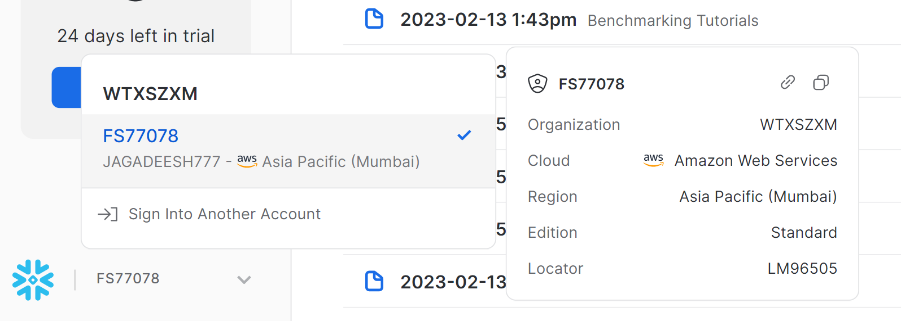

 
- **?db=PRODUCT** specifies the name of the Snowflake database you want to connect to.In this case, the database is named product.

- **&schema=products_vocabulary** specifies the name of the Snowflake schema that you want to use within the specified database. In this case, the schema name is **products_vocabulary**.

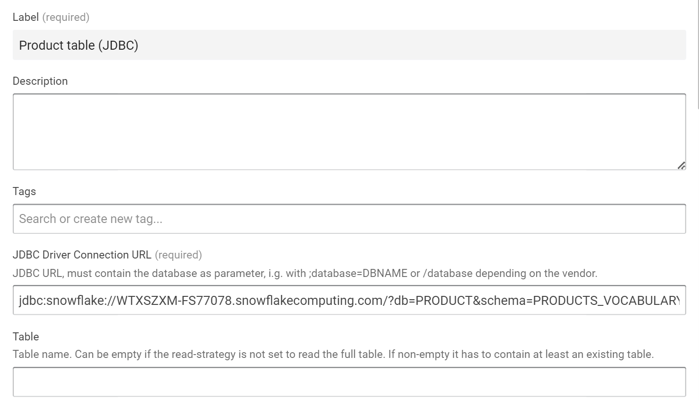

- Type Source query as 
```
SELECT * from PRODUCT
```

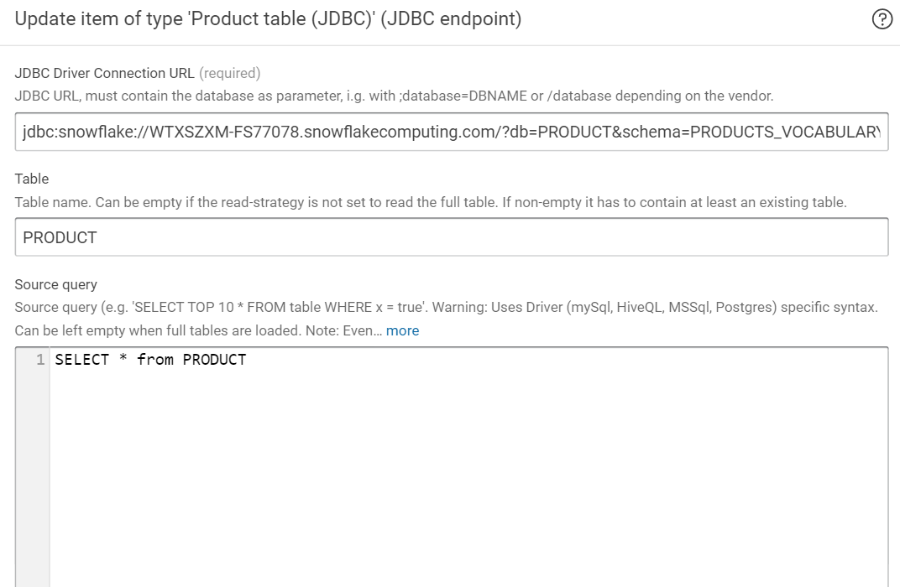

- Select the **Query strategy** as **Execute the given source query.No paging or virtual query**.


- Select the **Write strategy** as **An exception will be thrown, if the table already exists.**


- Click on the **advanced options**.

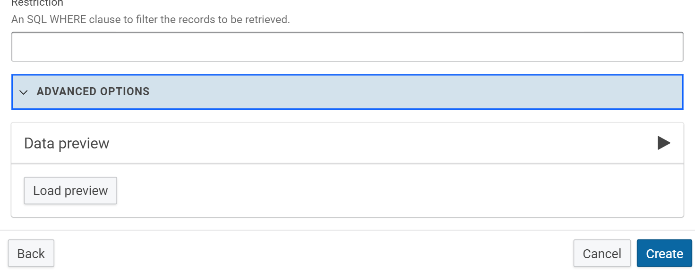

- Type **Username** and **Password** in the dialog window, then click on **create**.

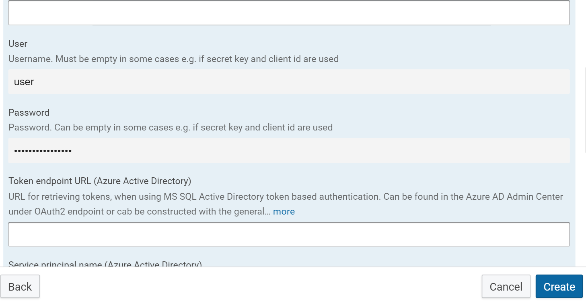

**Step Result**: JDBC endpoint is created and data is transferred from Snowflake to eccenca Corporate Memory.


## **4.Create a transformation to build mapping rules.**

- Click on **create** on the right side of the page.


- Click on **Transform** on the left side of the page, then on **Transform** in the centre of the page,then click on **add**.


- Type the name **product** in the **Label** field, in the **INPUT TASK Dataset** select **Product Table (JDBC)** and in the **Type** field select **table**.


- In the **Output** dataset field select **product graph**, then click on **create** .


- Click on **Mapping**, then click on **edit**.


- For  the target entity select  **Product (pv:product)**.


- Click on **create custom pattern**.

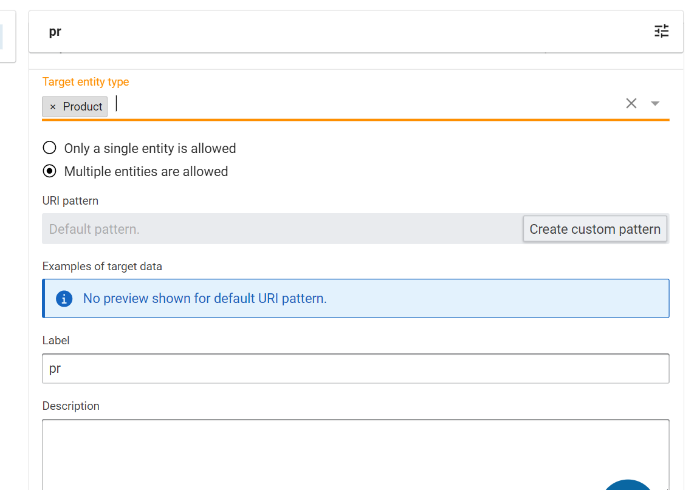

- Type the URI pattern as **http://id.company.org/product/jdbc**. You can use either company.org or company.com as per your requirement.Then type the label name as **product** and then click on **save**.


- Click on **+icon**, then select the **add value mapping**.


- Select the **target property** according to transformation requirements, for example name, id, etc., then select the **value path** according to the target property as the product name,product id etc. This step will help in mapping the data from the source to the target property.


- Type the label name **product name**, then click on **save**.


**Step Result** : Mapping rule is created successfully.


!!! Note

      We have the suggestion option as well; click on the **+icon** and select the **suggestion mapping**.


**Step Result** : Suggestion appears as below can select as per the requirement.


!!! Note 

       Suggestions generated are based on vocabulary which describes the data in the CSV files: products_vocabulary.nt


- **Tick** the box to select the suggestions to be added, then click on **add**.


## **5.Create a knowledge graph.**

- Click on **create** on the right side of the page.


- Select **Knowledge Graph**, then click on **add**.


- Select the **target project** from the drop down menu as **product**.


- Type  **product graph** in the label field, then enter the **graph URI** in the Graph field, then click on **create**.


**Step Result** : Graph is created successfully.

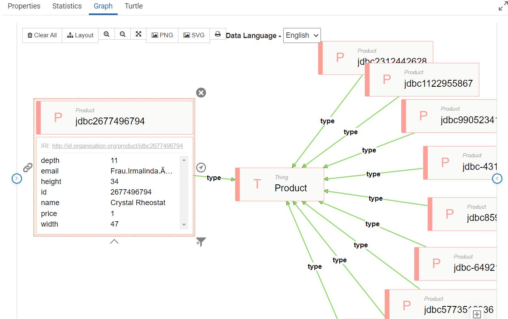


