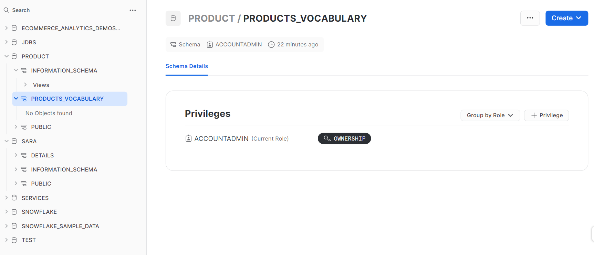
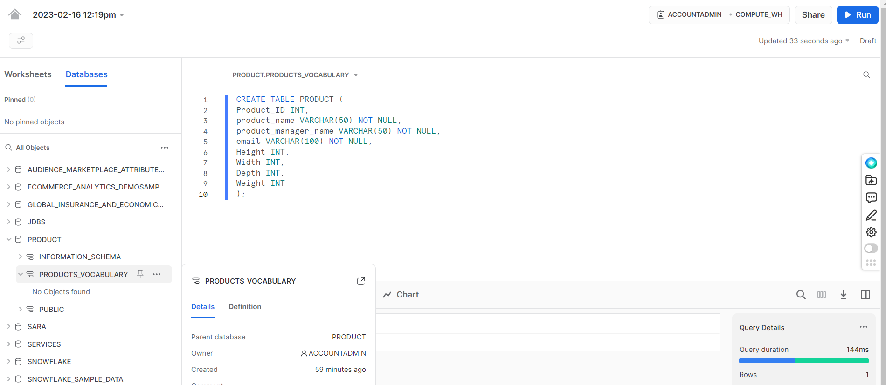
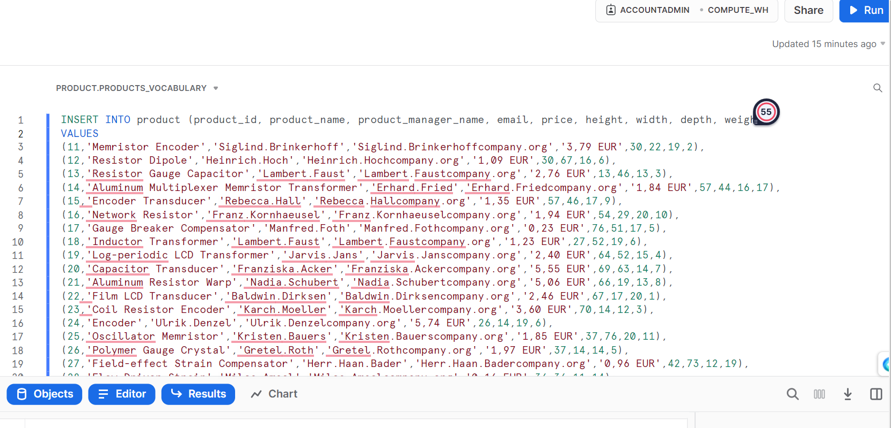
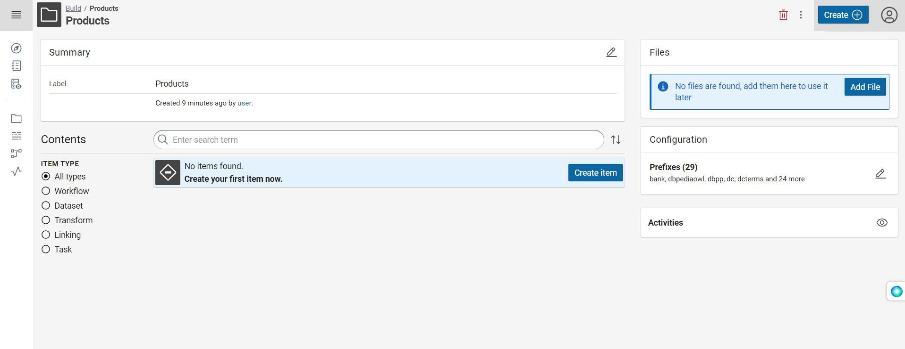

# **Snowflake**

## **Introduction**

Eccenca Corporate Memory is a semantic data management platform that allows organizations to store, manage, and interconnect vast amounts of structured and unstructured data.

Snowflake is a cloud-based data warehousing solution that provides a scalable and flexible platform for data storage and analysis. 

The eccenca Corporate Memory platform can connect to Snowflake to take advantage of Snowflake’s scalability and flexibility for data warehousing solutions. This connection allows organizations to store and manage large amounts of data in Snowflake while using eccenca Corporate Memory to link and interconnect with other data sources, such as databases and cloud applications, to form a comprehensive and unified view of all data assets.

By integrating Snowflake with eccenca Corporate Memory, organizations can achieve a centralized and unified data management system that allows them to gain a complete and accurate view of all their data assets. This integration enables organizations to make informed decisions, improve their business processes, and drive growth and innovation by leveraging their data assets. 

Step-by-step instructions to connect the Snowflake database with eccenca corporate memory:

## **1.Configure Custom JDBC Driver**.

To connect to Snowflake cloud data warehouse a JDBC driver is required. 

## **2.Create a database in snowflake**.

- Login to Snowflake enter the **username** and **password**, then click on **sign in**.

- Click on **Database** on the left side of the page.

- Click on **+Database** on the right side of the page.

- Type the database name **Product**, then click on **create**.

- Click on database **product**, then click on **+Schema** on the right side of the page.

- Type the schema name **products_vocabulary** and click on **create**.

- Click on scheme **products_vocabulary** on the left side of the page. 

- Click on **create**, then click on **table**, then select the **standard**.

- Click on schema name **products_vocabulary** on the left side of the page and type the  **sql query** for creating a table in the center, then click on **Run** on the right side of the page.

**Step Result** : The table is created as shown below.

- Type the SPARQL query for creating a database in the table that is created, then click on **run**.

       The following is an example of a query for the database.

INSERT INTO product (product_id, product_name, product_manager_name, email, price, height, width, depth, weight) 
VALUES 
(11,'Memristor Encoder','Siglind.Brinkerhoff','Siglind.Brinkerhoff Company.org','3,79 EUR',30,22,19,2).

**Step result** : The database has been created as shown below.

## **3. Create a project in eccenca Corporate Memory.**

- Click on **create** on the right side of the page.

- Click on project, then click on **Add**.

- Type the project name **product** in the title field, then click on **create**.

- Click on **create** on the right side of the page.

- Click on **JDBC endpoint**, then click on **add**.

- Type the name **product table (JDBC)** in the label field.

- Type the JDBC URL path in the **JDBC Driver connection URL** field.

!!! Note
This is a JDBC connection string for connecting to Snowflake data warehouse in eccenca corporate memory.

<!-- Note -> :snowflake: gives an emoji so, using \:snowflake\: for documentation-->

!!! Example 
jdbc\:snowflake\://WTXSZXM-FS77078.snowflakecomputing.com/?db=PRODUCT&schema=PRODUCTS_VOCABULARY.

Here is a breakdown of the elements of this example connection string.

- **jdbc\:snowflake\://** is the prefix for the snowflake JDBC driver.

- **WTXSZXM-FS77078.snowflakecomputing.com** is the URL for the snowflake account you want to connect to. The number **WTXSZXM-FS77078** is the organization number you will get from Snowflake as shown below.

- 
**?db=PRODUCT** specifies the name of the Snowflake database you want to connect to.In this case, the database is named product.

- **&schema=products_vocabulary** specifies the name of the Snowflake schema that you want to use within the specified database. In this case, the schema name is **products_vocabulary**.

- Type Source query as **SELECT *from PRODUCT**.

- Select the **Query strategy** as **Execute the given source query.No paging or virtual query**.

- Select the **Write strategy** as **An exception will be thrown, if the table already exists.**

- Click on the **advanced options**.

- Type **Username** and **Password** in the dialog window, then click on **create**.

**Step Result**: JDBC endpoint is created and data is transferred from Snowflake to eccenca Corporate Memory.

