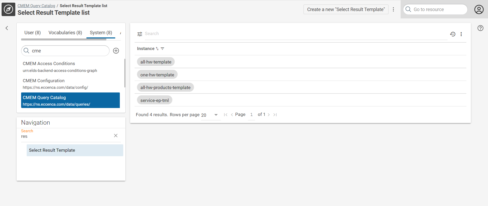
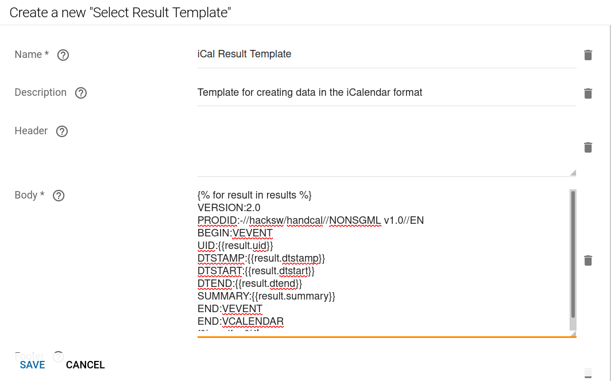
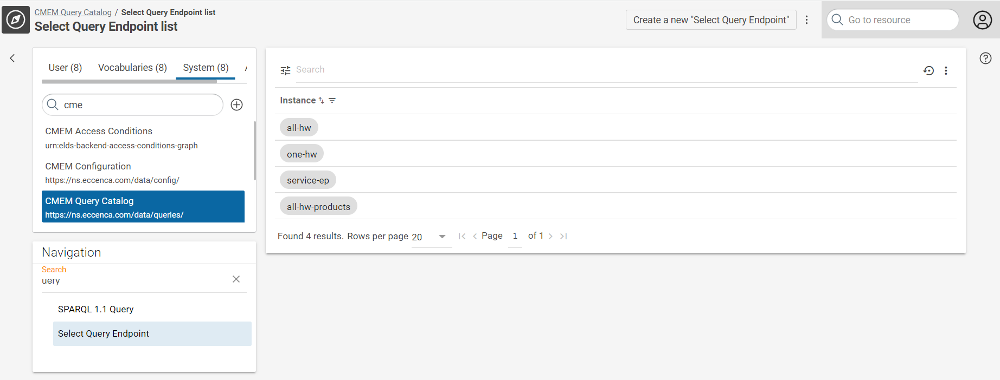

# Provide data in any format via a custom API

## Introduction

Learn how to provide data via a customized Corporate Memory API in a text format of your choice and how to consume it in your applications.
This tutorial describes how you can provide data in a text format of your choice via your own custom Corporate Memory API, and how you request those APIs.

As an example, we describe how you can set-up an endpoint which provides iCalendar data. If you want to rebuild the example, you can download this iCalendar RDF data and import it into your Corporate Memory instance: :material-file-download:[ical_data.ttl](./ical_data.ttl)

???+ example "iCalendar Event data"

    ```bash linenums="1"
    BEGIN:VCALENDAR
    VERSION:2.0
    PRODID:-//hacksw/handcal//NONSGML v1.0//EN
    BEGIN:VEVENT
    UID:20020630T230353Z-3895-69-1-0@jammer
    DTSTAMP:20020630T230353Z
    DTSTART:20020630T090000Z
    DTEND:20020630T103000Z
    SUMMARY:Church
    END:VEVENT
    END:VCALENDAR
    ```

## Define a SPARQL query

This query selects the event data in our graph which will be provided via the customized API. To rebuild the iCalendar format, we need at least the unique identifier (uid), the datetime start (dtstart), the datetime end (dtend), and the summary of the event. The query filters (replace) at the end the special characters ":" and "-", as they are not needed in the iCal DateTime format.

???+ example "Sample iCalendar SPARQL Query"

    ```sql linenums="1"
    PREFIX ical: <http://www.w3.org/2002/12/cal/icaltzd#>

    SELECT DISTINCT ?vevent ?uid ?dtstamp ?dtstart ?dtend ?summary

    WHERE {
    ?vevent a ical:Vevent .
        ?vevent ical:uid ?uid .
        ?vevent ical:dtstamp ?dtstamp_raw .
        ?vevent ical:dtstart ?dtstart_raw .
        ?vevent ical:dtend ?dtend_raw .
        ?vevent ical:summary ?summary  .

        BIND(REPLACE(STR(?dtstamp_raw),"[: -]","") AS ?dtstamp) .
        BIND(REPLACE(STR(?dtstart_raw),"[: -]","") AS ?dtstart) .
        BIND(REPLACE(STR(?dtend_raw),"[: -]","") AS ?dtend) .
    }
    ```

## Define a Template for the iCal format

As a next step, we will define a template which generates iCalendar data from our previously defined SPARQL query.

Select in *Graphs* the CMEM Query Catalog graph, select in *Navigation* the Select Result Template and click `Create a new Select Result Template` to create a new one.




Define a *Name*, a *Description* and the *Body* format. You may also define a Header or a Footer, but this is not necessary for this example.

The template engine we are using [Jinja](https://palletsprojects.com/p/jinja/). In Jinja, dynamic data within a template needs to be referenced via double curly brackets {{...}}. So the line {{result.uid}} inserts at execution time the ?uid value from our previously defined SPARQL query into this template. Everything outside curly brackets it static. As static data in our example, we define the full iCalendar format (..BEGIN:EVENT..). As we receive from the SPARQL query multiple results (iCalendar Events), we have to iterate through each of them. To define this iteration in the template, the following line needs to be added:

> 

and for the conclusion of the iteration, this line needs to be added at the end:

> 



???+ example "Jira Template for our iCalendar format"

    ```bash linenums="1"
    BEGIN:VCALENDAR
    VERSION:2.0
    PRODID:-//hacksw/handcal//NONSGML v1.0//EN
    
    BEGIN:VEVENT
    UID:{{result.uid}}
    DTSTAMP:{{result.dtstamp}}
    DTSTART:{{result.dtstart}}
    DTEND:{{result.dtend}}
    SUMMARY:{{result.summary}}
    END:VEVENT
    

    END:VCALENDAR
    ```

## Create an API based on your template

As a next step, we will set-up the API which serves the data in the format you defined in the previous template.

Select in *Graphs* the CMEM Query Catalog graph, select in *Navigation* the Select Query Endpoint and click "Create a new Select Query Endpoint" to create a new one.



Define a Name, a human-readable keyword (aka *[URL Slug](https://en.wikipedia.org/wiki/Clean_URL#Slug)*) for the API path, choose if it is a Streaming endpoint (false in our example), a Description, select the defined SPARQL Query from our first step and select the Template we created in the second step. Once you press save, your endpoint it set up!


## Consume data via the endpoint

Now that the endpoint is defined, it is possible to make a request to receive the iCal data. The endpoint URL consist of the path `/dataplatform/api/custom` and the previously defined URL Slug (/ical).

??? example "/ical request"
    ```curl
    curl 'https://<cmem_instance>/dataplatform/api/custom/ical' -H 'Authorization: Bearer <token>'```

The `<token>` can be fetched by:

```cmemc admin token```

??? example "/ical response"

    ```bash linenums="1"
    BEGIN:VCALENDAR
    VERSION:2.0
    PRODID:-//hacksw/handcal//NONSGML v1.0//EN

    BEGIN:VEVENT
    UID:20020630T230353Z-3895-69-1-0@jammer
    DTSTAMP:20020630T230353Z
    DTSTART:20020630T090000Z
    DTEND:20020630T103000Z
    SUMMARY:Church
    END:VEVENT

    BEGIN:VEVENT
    UID:20020630T230445Z-3895-69-1-7@jammer
    DTSTAMP:20020630T230445Z
    DTSTART:20020703
    DTEND:20020706
    SUMMARY:Scooby Conference
    END:VEVENT

    BEGIN:VEVENT
    UID:20020630T230600Z-3895-69-1-16@jammer
    DTSTAMP:20020630T230600Z
    DTSTART:20020718T090000
    DTEND:20020718T093000
    SUMMARY:Federal Reserve Board Meeting
    END:VEVENT

    END:VCALENDAR
    ```

This result represent as valid ICalendar (ics) format and can be imported into your calendar client. :material-file-download:[event_data.ics](https://documentation.eccenca.com/files/latest/15109509/15109532/1/1608660583878/event_data.ics)

## Configuration remarks

### Streaming

If Is *Streaming* is set to false for the endpoint (as in the given example) the respective Jinja Template needs to resolve a results variable, which is a list of all query results and you need to iterate over the variable using Jinja constructs ``. A non-streaming result set (the SPARQL query) is limited to 1000 elements. If more results are expected Is Streaming should be set to true.

If Is Streaming is set to `true` the Jinja Template has to resolve a `result` variable (without the 's'), which is a single query result and the template engine iterates over the results, i.e. the Body template is repeated for each query result.
