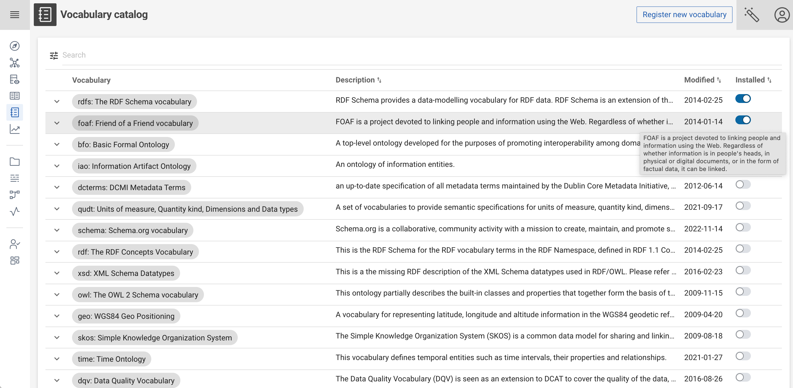
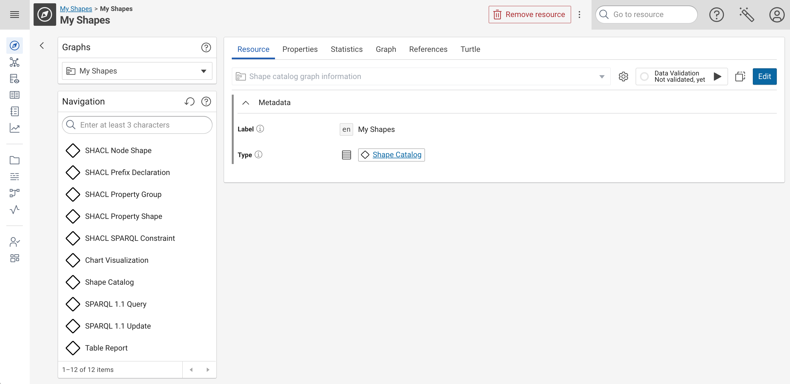
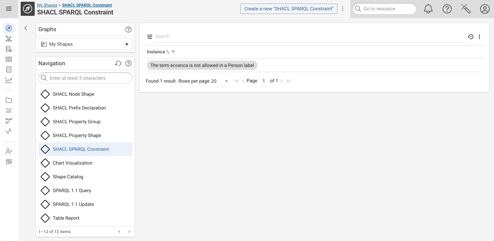
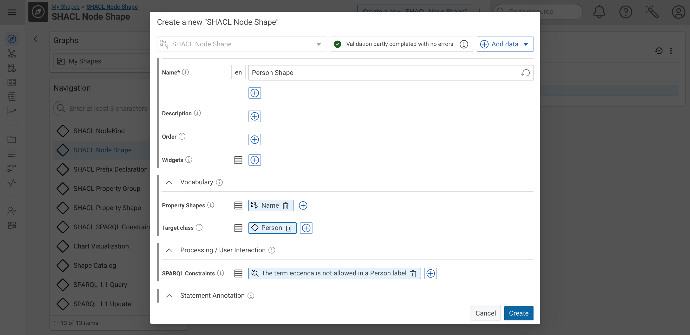
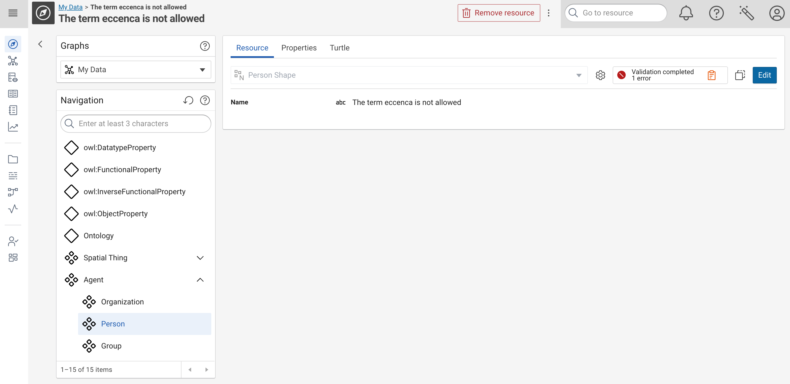

# Using SPARQL Constraints for Custom Resource Validation

## Introduction

SHACL (Shapes Constraint Language) is a language for validating RDF data based on predefined shapes or constraints.
SHACL SPARQL Constraints are a set of rules defined using SPARQL queries within SHACL shapes to express more complex validation logic that cannot be easily represented by other SHACL constructs.

Key advantages:

- **Complex logic**: You can implement any logic supported by SPARQL, such as aggregation, advanced pattern matching, or value ranges.

- **Reusable queries**: SPARQL constraints allow the reuse of sophisticated query logic across different shapes and data types.

## Setup

SPARQL Constraints are resources which need to be managed in a Shape Catalog.
This catalog graph needs to be imported (virtually, with `owl:imports`) into the main CMEM Shapes Catalog.
Similar to property shapes, SPARQL Constraints needed to be linked from a Node Shape in order to select the set of shapes which are used for a given selection of resources.

## Example

In our running example, we create a Node Shape for `foaf:Person` resources.
Then we add a SPARQL Constrain shape, which ...

### Install needed Vocabularies

Go to the **:eccenca-application-vocabularies: [Vocabulary catalog](../../../vocabulary-catalog)** and install the RDF Schema and FOAF Vocabulary.
Your vocabulary catalog should look like this after installation

{ class="bordered" }

### Create a Shape Catalog

Go to **:eccenca-application-explore: [Knowledge graphs](../../../graph-exploration)** and create a **New Shape Catalog**.
Name the graph e.g. *My Shapes*.
After this step, the browser shows you a nearly empty graph which shows SHACL classes such as **SHACL Node Shape** and **SHACL SPARQL Constraint** in the navigation.

{ class="bordered" }

### Create a SPARQL Constraint

Select **SHACL SPARQL Constraint** in the Navigation component, then use the **Create a new "SHACL SPARQL Constraint"** button in the top right corner to create a new resource.
Fill in a label and a SPARQL SELECT Query.

For our example, we use the following values:

- Label: `The term eccenca is not allowed in a Person label`
- SPARQL Select:

``` sparql
PREFIX foaf: <http://xmlns.com/foaf/0.1/>
PREFIX  rdfs: <http://www.w3.org/2000/01/rdf-schema#>

SELECT $this (rdfs:label as ?path) (?label as ?value)
WHERE {
  $this a foaf:Person ;
  rdfs:label ?label .
  FILTER( REGEX(STR(?label), "eccenca" ))
}
```

Note that the projection variables of SPARQL Constraint queries need to be named according to the [SHACL Specificaton](https://www.w3.org/TR/shacl/#sparql-constraints-example) (`$this`, `?path`, `?value`).
After you clicked on **Create** you should see your new resource in a list.

{ class="bordered" }

### Create a Node Shape

Select **SHACL Node Shape** in the Navigation component, then use the **Create a new "SHACL Node Shape"** button in the top right corner to create a new resource.

Enter the following values:

- Name: `Person Shape`
- Target class: Select `Person` from the FOAF vocabulary
- SPARQL Constraints: Select your new constraint from the list (your have to use the **:material-plus-circle-outline: Add data** menu to extend the form with this non-default input field)
- Property Shapes: Create a new property shape with
    - Name: `Name`
    - Show always: `true`
    - Path: `rdfs:label`
    - Node Kind: `Literal`

Before you create your new Node Shape (and new Property Shape) your screen should look like this:

{ class="bordered" }

### Validate the Shape

Now we can validate the shape by creating a Person with a label which contains the term `eccenca`.

- Go to **:eccenca-application-explore: [Knowledge graphs](../../../graph-exploration)** and create a **New Knowledge Graph**.
    - Name: `My Person Data`
    - Imports: `foaf: Friend of a Friend vocabulary`
- Select **Person** in the Navigation component, then use the **Create a new "Person"** button in the top right corner to create a new resource.
    - Name: `The term eccenca is not allowed`

The validate the resource with the validation button. You will see a screen like this:

{ class="bordered" }

When you open the validation report, you will see a error message such as: **The value does not conform to SPARQL constraint**.

