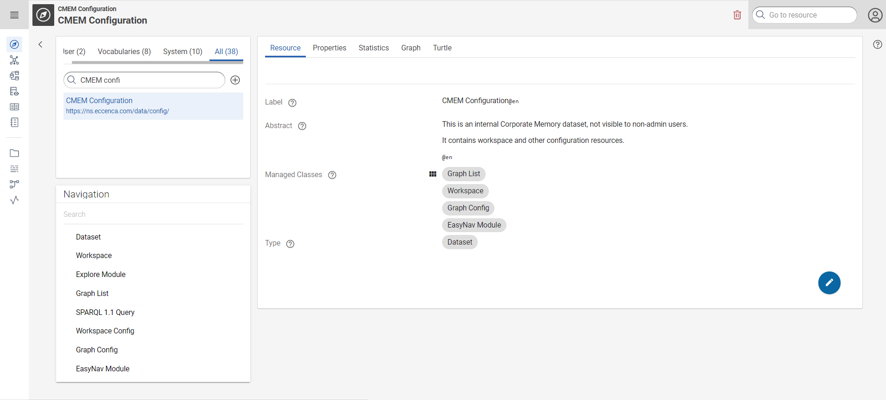
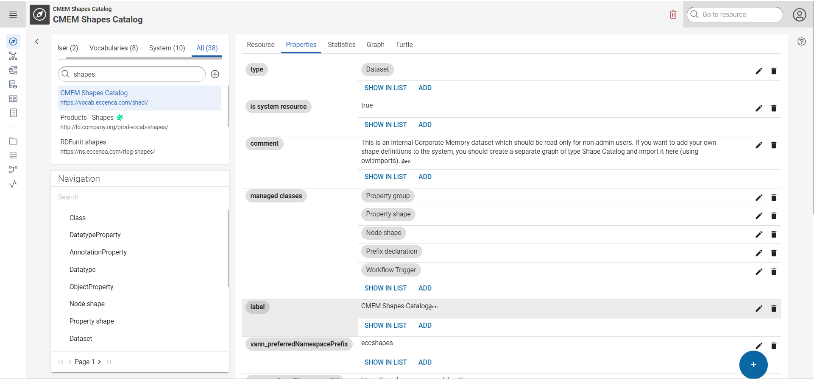
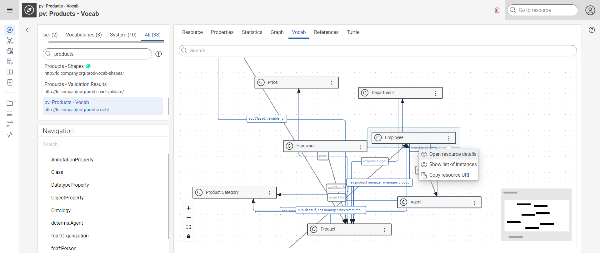
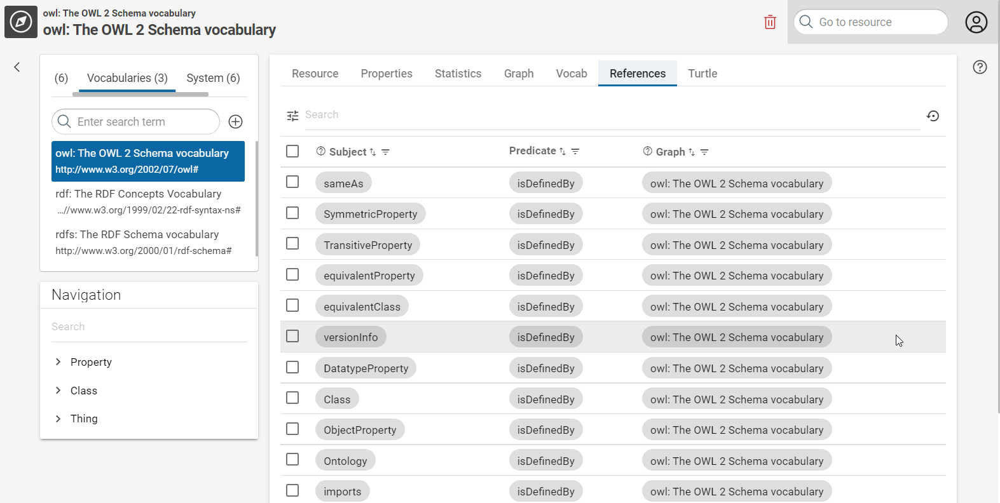

# Graph Exploration

## Introduction

The Explore module provides a generic and extensible RDF data browser and editor. Use the Explore module to browse through your resources, to change between list and detail views and to edit resources.

To open the Explore module, click EXPLORE in the Module bar.

The user interface of the Explore module shows the following elements:

-   [Graphs](#graphs) box
-   [Navigation](#navigation) box
-   Main window

The main window provides multiple views depending on what resource has been selected. If necessary, you can hide the Graphs and Navigation boxes: To hide the boxes, click { .off-glb } in the upper left corner. To show the boxes again, click { .off-glb }.

## Graphs

The Graphs box shows the list of graphs you have access to. A Lock icon { .off-glb } indicates that you have only read access to this graph and are not allowed to edit data of this graph. To select a graph click the graph name in the Graphs box. The structure of the selected graph is displayed in the Navigation box below. On the right window, the Metadata view of the selected graph appears showing several tabs with metadata information.

The Graphs are categorized into groups as follows:

-   System : List all the system graphs that are available by default.  In this you can search only system specific graphs. 
-   User: List all the graphs created by users. 
-   Vocabularies :  List all the graph that belongs Vocabularies 
-   All

### Adding a new graph

To add a new graph to the Graphs list:

-   In the **Graphs** box, click Add graph{ .off-glb }
-   Click **Add new graph**. A dialog box appears.
-   Enter the graph URI (e.g. [https://ns.eccenca.com](https://ns.eccenca.com/)) for the new graph.
-   *Optional*: Click **Choose file** to upload a file containing the graph data. You can upload one of the following file formats: Turtle, N-Triples, RDF/XML, or JSON-LD.
-   Click **ADD GRAPH** to save the new graph.

Note: When adding a new graph you can enter only a URI and skip the upload step. You can upload a file at a later date using the [Managing a graph](#managing-a-graph) option.

### Downloading a graph

To download a graph from the Graphs list:

-   In the **Graphs** box, select the graph you want to download.
-   In the **Graphs** box, click Download graph icon. 
-   Click **Download graph**. A message box appears, stating that downloading can take a long time.
-   Click **DOWNLOAD**.

### Managing a graph

Use this function to add updated data to a graph, to replace data or to delete a graph.

To update or replace data of a graph:

-   In the **Graphs** box, select the graph you want to update or replace.
-   In the **Graphs** box, click Manage graph icon.
-   Click **Manage graph**. A dialog box appears.
-   Click **Choose file** to upload a file containing the new or updated data. You can upload one of the following file formats: Turtle, N-Triples, RDF/XML, or JSON-LD.
-   Choose one of the following options:
    -   `Update`: add uploaded data to Graph.
    -   `Replace`: clear Graph and add uploaded data.
-   Click **UPDATE** to save your changes.

To delete the graph click the Delete icon { .off-glb } and confirm or cancel the deletion process.

## Navigation

When a graph is selected in the Graphs box the structure of the graph is displayed in the Navigation box. By default, only the top classes of the graph are listed. An arrow { .off-glb } indicates that a class has subclasses. Click the arrow to show the subclasses.

Use the Search field of the Navigation box to search for a keyword in the navigation structure of the graph. Enter a keyword and press Enter to start the search. To reset the results delete the keyword and press Enter.

### Instance List of a class

Select a class in the Navigation box to show all instances of this class in the Instance List on the right window.

[](./graphoverview.png)

Click { width=20 .off-glb } to change the shown resources via the defined SHACL-shape form.

Alternatively, click Properties to add or modify the properties.

[](./properites.png)

### Custom Instance List

The table uses a default query to list all resources with a given class.

For more complex representations, it is possible to customize the view adding a triple of the form

``` s
<ShaclShapeURI>
  <https://vocab.eccenca.com/shui/navigationListQuery>
    <sparqlQueryURI> .
```


The sparqlQueryURI has a queryText which can contain the following placeholders: {{FROM}}.

For example, having the following shape associated to PropertyShape:

``` s
<https://vocab.eccenca.com/shacl/ShaclPropertyShapeNodeShape>
  <http://www.w3.org/ns/shacl#targetClass>
    <http://www.w3.org/ns/shacl#PropertyShape> .
```


and adding the following triples:

``` s
<https://vocab.eccenca.com/shacl/ShaclPropertyShapeNodeShape>
  <https://vocab.eccenca.com/shui/navigationListQuery>
    <https://vocab.eccenca.com/shacl/shaclPropertyShapeListQuery> .

<https://vocab.eccenca.com/shacl/shaclPropertyShapeListQuery>
  a <https://vocab.eccenca.com/shui/SparqlQuery> ;
  <http://www.w3.org/2000/01/rdf-schema#label>
    "Shape Shapes: UI query for listing property shapes" ;
  <https://vocab.eccenca.com/shui/queryText> """
PREFIX rdfs: <http://www.w3.org/2000/01/rdf-schema#>
PREFIX shacl: <http://www.w3.org/ns/shacl#>
PREFIX shui: <https://vocab.eccenca.com/shui/>
SELECT DISTINCT ?propertyShape ?path ?description
{{FROM}}
WHERE {
  ?propertyShape a shacl:PropertyShape .
  OPTIONAL { ?propertyShape shacl:path ?path } .
  OPTIONAL { ?propertyShape shacl:description ?description } .
  FILTER isIRI(?propertyShape)
}""" ;
  <https://vocab.eccenca.com/shui/queryType> "SELECT" .
```


will result in an custom Instance List for the class `<http://www.w3.org/ns/shacl#PropertyShape>` :

[](./Bildschirmfoto+2020-08-11+um+14.52.13.png)

### Instance Details

To open the Instance Details of a resource click on that resource in the Instance List. Resources are shown as grey buttons.

Use { .off-glb } on the right upper corner to remove the resource. A dialog box appears where you are asked to confirm the operation.

!!! info
    When you remove the resource all triples related to that resource are deleted too.

The instance data is provided on the following tabs:

[](./instancedata.png)

## Metadata of graphs

To display metadata of a graph, select a graph in the Graph box on the left side. In the main window you see the metadata arranged in the following tabs:

-   [Resource](#resource)
-   [Properties](#properties)
-   [Statistics](#statistics)
-   [Graph](#graph)
-   [Vocab](#vocab)
-   [References](#references)
-   [Turtle](#turtle)
-   Usage

!!! info
    The **Usage** tab is only displayed when it contain data.

### Resource

The Resource tab provides the following metadata of a graph:

-   Label: Name of the graph
-   Abstract: Description of the graph
-   Type: Allows you to set type of graph
-   Authors: Lists the authors of the graph
-   Publisher: Shows the publisher of the graph
-   Current Version: Current version number of the graph
-   Date of Last Modification: Date when the graph was last modified
-   Preferred Namespace: Preferred namespace and URI, like <https://vocab.eccenca.com/dsm/>
-   Preferred namespace prefix: is used as a (short)reference in SPARQL queries
-   Namespaces: Lists the namespaces used by the graph
-   External Links: Links to internet resources: homepages, pages, SPARQL endpoints or data dumps
-   Creation Date: Creation date of the graph
-   Issued: Publication date of the graph
-   Publisher: Publisher of a graph

The property Namespaces shows only those namespaces that are specified by the respective property. But it is possible that the graph actually uses more namespaces than indicated.

Note: The descriptions given comply with the intended usage of the respective properties. But in practice these properties are often used with a wrong content. Therefore in some cases the description given may not correspond to the actually displayed metadata of a graph.

### Properties
This tab shows all properties and objects of the selected resource.

[](./properites.png)

Use the icons on the right side to edit or delete properties. Use SHOW IN LIST to display objects in a list view. Click ADD to add a new value as an object to a property. In the dialog box, select the type from the drop-down list and enter the value. Click SAVE to save your changes.

To add a new property click { .off-glb }. In the dialog box, enter a property, select the value type from the drop-down list and enter a value. Click SAVE to save your changes.

### Statistics

The Statistics tab indicates the number of classes, properties, entities and triples of the graph. To show these values the application uses by default the VoID Statistics contained in the graph.

[](./statictics.png)

Use { .off-glb } Update VoID statistics to update the values with a new query. Depending on the size of the graph this operation can take some time.

Use { .off-glb } Save to save updated VoID statistics in the graph. The Save button can only be used when an update query was executed before or when the option auto fetch VoID Statistics is activated. Saving VoID statistics does not modify the property Date of Last Modification.

In order to display the metadata of a graph various properties are analysed that are contained in the graph itself. If these properties are missing in the graph, some metadata properties may remain empty. These empty properties are hidden by default.

!!! info
    If you leave this module or even the view, this option is reset to the default setting.

!!! info
    The values given in VoID Statistics can be obsolete. If the graph does not contain the required VoID Statistics no value is displayed.

### Graph

The Graph tab shows a visual graph representation of the ontology concepts in a graph selected in the Graphs box.

It displays ontology classes as circle-shaped nodes, which are connected by directed, labelled edges (arrows) representing properties. Classes defined by the ontology are colored light blue. External, referenced classes are colored dark blue and have the additional label "(external)". You can zoom in and out of the graph using your mouse wheel or "pinching", if you have a touch screen or touch pad. You can drag the canvas by left-clicking the canvas, holding the click and moving the mouse.

[](./graphvisulization.png)

### Vocab

This tab displays graph visualization of installed vocabularies. It displays all classes showing the class-subclass.  You can open the class details and view list of instances related to that class. It also allows you to copy resource IRI.

[](./vocab.png)

### References

This tab shows all properties that use the selected resource as an object.

[](./Reference.png)

### Turtle

This tab shows the turtle RDF representation of the raw data representing the resource. You can use this tab to edit the selected resource:

-   Enter your changes in turtle.
-   Add a changelog comment (optional).
-   Click **UPDATE** to save your changes.

Deleting the entire turtle representation deletes the resource.
