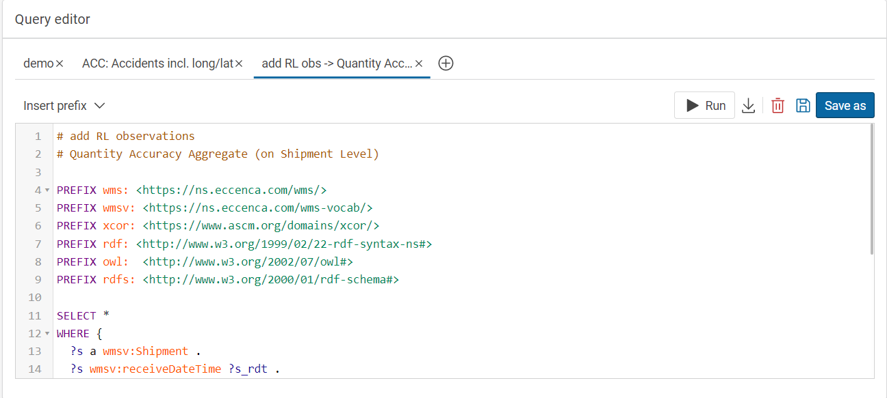
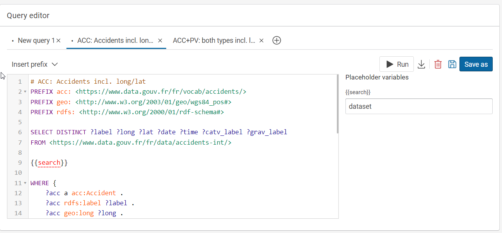

# Query Module

## Introduction

The Query module provides a user interface to store, describe, search and edit SPARQL queries.The queries are evaluated on the Knowledge Graph (quad store) provide a way to granularly aggregate semantic data as tables. These tables can then be exported as CSV, Excel or JSON.

The Query module features three tabs [Catalog](#query-catalog), [Query](#query-tab) and [Info](#). To access the module click QUERY in the Module bar.

## Query catalog

The Catalog tab is the default view of the Query module. It lists all existing SPARQL queries including their metadata, such as name, type, a human readable description as well as creation and modification dates. To create a new query in the catalog, use the{ .off-glb } button on the lower right. Click this button to create a new query in the [Query](#query-tab) tab using SPARQL (SPARQL Protocol And RDF Query Language - see <https://www.w3.org/TR/rdf-sparql-query/> for further information).

Use the Search bar in order to filter for specific queries.


Select the query from the Queries catalog, to open and load the query. 

To delete an existing query, click{ .off-glb }.

!!! info

    Deleting a query cannot be undone.

## Query tab

Use the Query tab to edit and execute SPARQL queries. In this view you can also browse query result previews and download full query results as CSV files.

The main feature of the Query tab is the query editor, which provides an interface where you can write and edit your SPARQL queries. The query editor features SPARQL syntax highlighting and SPARQL validation, allowing only syntactically correct SPARQL queries to be executed.

The Query editor allows to Run query, Download Results, Delete, Save and Save as Queries.



### Running a query and exporting results

Click RUN QUERY to execute the query and to display a preview of the query results under the query editor. The results are presented as a table with pagination.

To export the full set of results without any limits in form of a CSV file click Download as... on the top right. 


!!! info

    The preview result ordering has no impact on the result ordering in the exported file. If you want to export some ordered query results, you need to use the `ORDER BY` construct in the SPARQL query itself.

### Saving a query

To save a query in the Query catalog click SAVE QUERY.

If you have loaded the current query from the Query catalog and edited it, clicking SAVE QUERY opens a dialog that allows you to either overwrite the existing query or store it as a new query.

If you have created the current query from scratch, the query will immediately be saved to the Query catalog.

After saving a query, the [Info](#query-tab) tab is opened in edit mode. When you cancel the operation at this point only editing the metadata is canceled, not saving the query to the Query catalog.

### Using placeholders in queries

In addition to the standard SPARQL syntax, placeholders can be used to parametrize a query. Placeholders are indicated in the query using a string of the form `{{placeholdername}}`. Multiple placeholders can be defined by changing the name inside the brackets.

When a query contains a placeholder, the placeholder list to the right of the query editor shows a field with its name.



When running a query that contains placeholders, the query editor replaces the `{{placeholdername}}` string in the query with the respective string entered into the placeholder list. This is a direct string replacement, so placeholders can contain simple strings and literal values, URIs, variables or even sub queries.

Running a query with a placeholder is only possible when all placeholder fields in the placeholder list have been filled.

A typical use case is restricting a query to a specific class of objects stated by a placeholder:

``` sql
SELECT * WHERE { ?classInstance a <http://dbpedia.org/ontology/{{class}}> .}
```

This query selects all instances of a specific DBpedia Ontology class. When you enter Person into the `class` placeholder field in the placeholder list the following query is executed:

``` sql
SELECT * WHERE { ?classInstance a <http://dbpedia.org/ontology/Person> .}
```

SQL

This feature allows for easy parametrization without having to know correct SPARQL syntax or URIs.
