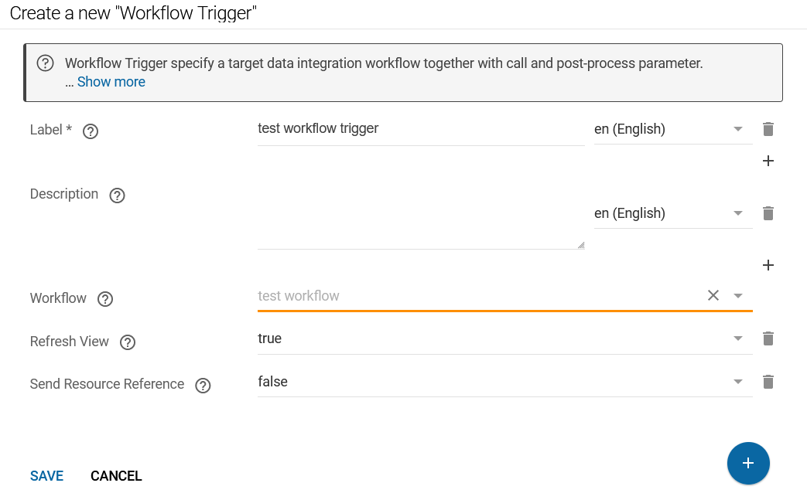

# Workflow Trigger

## Introduction

Workflow Triggers allow for execution of data integration workflows inside of the exploration interface.

Optionally, a reference to the resource in view on workflow execution can be sent, allowing an executed workflow to act specifically on this resource (or a specific portion of the Knowledge Graph related to it). Workflow triggers are associated to Node Shapes by defining special-purpose non-validating Property Shape resources.

## Defining Workflow Triggers

Workflow Triggers can be defined and used in any active [Shape Catalog](../../explore-and-author/building-a-customized-user-interface) (active means, it is imported from the main Shape Catalog). A workflow trigger resource references a data integration workflow by URI.



To define a workflow trigger the following information is needed:

-   **Label**: The trigger resource needs a label (can be given in different languages), which is used for the button presentation.
-   **Description**: The trigger resource needs a description, which is used as text that is sitting left of the button for further documentation of the activity to the user.
-   **Workflow**: the workflow parameter defines the workflow that shall be executed upon clicking the button. The workflow can be selected from a dropdown list.
-   **Refresh View**: can be either `true `or `false`*.* If this value is set to `true`, the view that contains the workflow trigger will be reloaded upon workflow completion
-   **Send Resource Reference**: can be either `true `or `false`. If this value is set to `true`, a payload that consists of the *resource IRI* that is represented in the view as well as the *graph IRI *of the graph that is currently selected*.*

## Integration

Once a trigger resources is defined, it can be attached to a Node Shape by using a special-purpose non-validating Property Shape resources. Such property shapes use a `shui:provideWorkflowTrigger` statement to define, which workflow trigger are to be represented. SHACL path statements on such Property Shape resources are meaningless and ignored, but may be provided.

## Payload Structure

When *Send Resource Reference* is set to *true,* a payload is added to the call of the workflow. The payload consists of a JSON document with two attributes:

Workflow Payload

``` json
{
   "graphIRI": "http://example.org/example-graph",
   "resourceIRI": "http://example.org/example-graph/examle-resource"
}
```

-   `graphIRI` is the IRI of the graph that is currently viewed and
-   `resourceIRI `is the IRI of the resource that is viewed