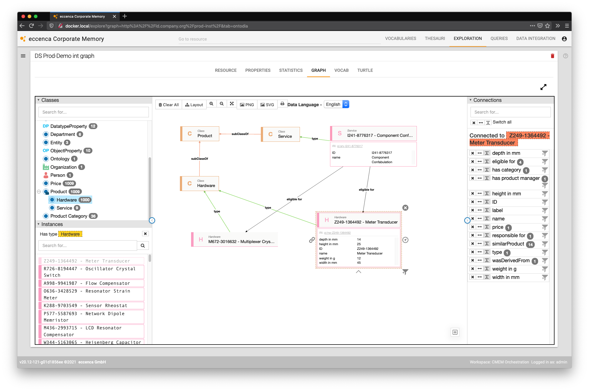
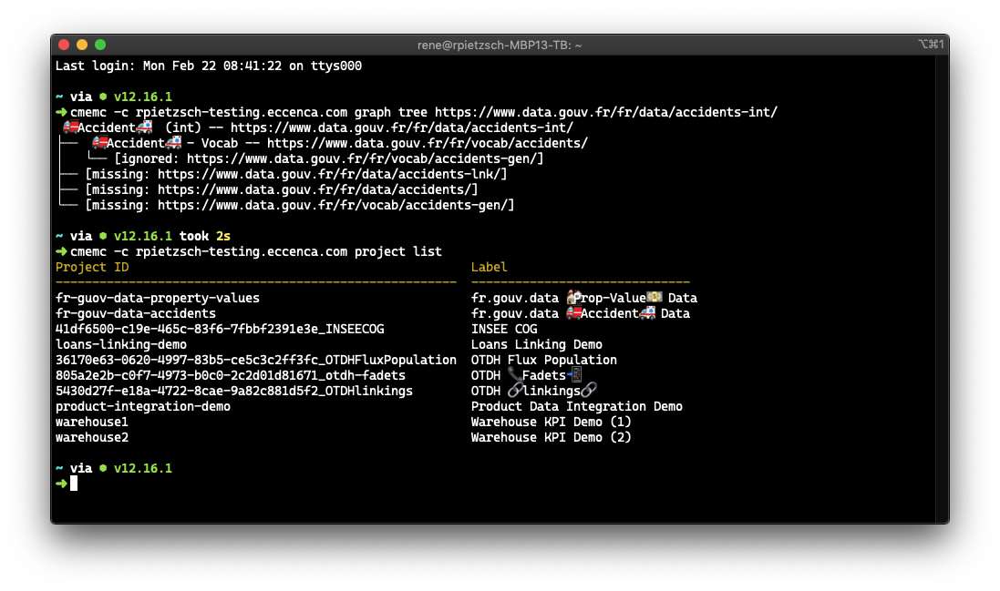

# Corporate Memory 21.02

Corporate Memory 21.02 is the first release in 2021.

The highlights of this release are:

- Build: Our re-designed mapping suggestion wizard make bootstrapping of your transformations a quick and easy exercise.
- Explore: interactively and visually browse through your graph with our integrated GRAPH visualization.
- Automate: The command line has never been more colorful, enjoyable and helpful (guessing your wishes as typos might happen). Experience the UX centric redesign of our command line client cmemc.

!!! warning

    With this release of Corporate Memory the DataIntegration, DataManager, DataPlatform configuration and cmemc command behavior has changed and have to be adapted according to the migration notes below.

This release delivers the following component versions:

- eccenca DataPlatform v21.02.1
- eccenca DataIntegration v21.02.1
- eccenca DataManager v21.02
- eccenca Corporate Memory Control (cmemc) v21.02

More detailed release notes for these versions are listed below.

## eccenca DataIntegration v21.02.1

This version of eccenca DataIntegration adds the following new features:

- REST request operator:
    - added "Accept all SSL certificates" parameter in advanced section. Default: `false`.
- If the option `eccencaDataPlatform.writeGraphType` is set to true the a graph in CMEM generated by Dataintegration will contain a triple (`<graph> rdf:type di:Dataset`) indicating that this graph was written by DataIntegration.
- Improved mapping suggestion:
    - Allows to select from multiple matching candidates.
    - The user can switch between data source and target vocabulary view.
    - A sub-set of the vocabularies can be selected.
    - The user can pick any (non-matched) property from the target vocabularies via search.
    - Improved filtering and sorting.
    - Added multi word text search filter.
    - Allows to choose am existing or custom URI prefix for the auto-generated target properties.
    - Added tooltip for source paths with e.g. example values.
    - Added tooltip for target property selection with meta data and a link to DataManager for that property resource.

In addition to that, these changes are shipped:

- The "Timestamp to date" and "Date to timestamp" transformers support configurable time units and full `xsd:dateTime` values.
- Updated build to Spark 2.4, Scala 2.12 and sbt 1.x
- If a transformer inside a linkage rule throws a validation error, it will no longer fail the entire linking task, but will not generate a value for that transformer.
- In the linking evaluation view and the reference links view, validation errors are shown in the evaluation tree.
- Allow to persist caches between restarts in order to reduce application start-up time.

In addition to that, multiple performance and stability issues were solved.

## eccenca DataManager v21.02

This version of eccenca DataManager adds the following new features:

- Explore
    - Add a tab with the Ontodia tool to explore graph detail view.
    - Make the Ontodia tab configurable: js.modules.explore.details.ontodia.enable
- Shacline
    - Display rdfs:comment of the selected node shape in the shacl form view.
    - Add group:comment to the header of groups.

In addition to that, these changes are shipped:

- Explore
    - Remove js.modules.explore.graphlist.internalGraphs from DataManager config since DataPlatform is now providing this information.
    - Rename tab: ontodia (Data@en, Daten@de).
    - Rename tab: visualization (Vocab@en, Vocab@de).
    - Move ontodia tab next to visualization tab.
- Vocabulary
    - Fix format to new endpoint with Titles already loaded.

In addition to that, multiple performance and stability issues were solved.

## eccenca DataPlatform v21.02.1

This version of eccenca DataPlatform ships the following new features:

- GraphDB datastore implementation
    - Added `spring.servlet.multipart.max-file-size: "20GB"` in properties files and dist file.
    - Added `useDirectTransfer` to use native Graph Store operation without shared folder
- Admin Endpoint for listing currently running queries.
- Graph API
    - New endpoints for owl:imports resolution.
- Bootstrap Data
    - Shapes for managing prefix declarations
    - Shape catalogs have prefix declarations as managed classes.
- Imports resolution
    - `owl:imports` self references ignored.
    - `owl:imports` are now resolved for graph uris in request parameters.
- Vocabulary List
    - Title resolve according to standard i18n settings.
- Shapes Endpoint
    - Comments of shapes included.

In addition to that, these changes are shipped:

- Dist Config
    - `skos:prefLabel` now preferred over `rdfs:label`.
- Query Logging
    - Query logging uses console appender only.
    - Query logging level set to `DEBUG`.
    - Environment variables no longer needed:
        - `QUERY_LOGGING_DIR`
        - `QUERY_LOGGING_MAX_FILE_SIZE`
        - `QUERY_LOGGING_TOTAL_SIZE_CAP`
        - `QUERY_LOGGING_MAX_HISTORY`

In addition to that, multiple performance and stability issues were solved.

## eccenca Corporate Memory Control (cmemc) v21.02

This version of cmemc adds the following new features:

- New configuration option `OAUTH_GRANT_TYPE=prefetched_token`
- New `admin token` command, fetch and output an access token
- New `project open` command, open projects in the browser
- `graph list` command
    - Added table output with graph type and label.
    - `--id-only` option added: get only graph IRIs.
- `project list` command
    - Added table output with project ID and label.
    - `--id-only` option added: get only project IDs.
    - `--raw` option added: get raw JSON.
- `workflow list` command
    - Added table output with workflow ID and label.
    - `--id-only` option added: get only graph IRIs.
    - `--raw` option added: get raw JSON.
- `graph list` command
    - `--filter imported-by IRI` added: filter to all graphs imported recursively by a graph.
- `graph tree` command added, output `owl:imports` tree for each selected graph.
- `graph export` and `graph delete` command
    - `--include-imports` option added: work with selected graph(s) and all graphs which are imported from the selected graph(s).
- `workflow list` command
    - `--filter` option added: filter by project or io command capability (input, output, both, any).
- `graph export` command
    - `--create-catalog` added: create a Protege XML catalog for import resolution.
- `query status` command, list and view still running and executed queries.
- output coloring
    - json output is highlighted
    - help texts are colored (red terms indicate writing commands, possible dangerous to your data)
    - table headers are colored
- git-like did-you-mean command suggestion for misspelled commands

In addition to that, these changes are shipped:

- docker image: now based on `debian:stable-20201209-slim`.
- `graph list` command
    - default output changed.
    - use the `--id-only` or `CMEMC_GRAPH_LIST_ID_ONLY=true` to get the IRI list.
- `project list` command
    - default output changed.
    - use the `--id-only` or `CMEMC_PROJECT_LIST_ID_ONLY=true` to get the ID list.
- `workflow list` command
    - default output changed.
    - use the `--id-only` or `CMEMC_WORKFLOW_LIST_ID_ONLY=true` to get the ID list.
- `graph list` command
    - filter option changed.
    - use `--filter access readonly`|`writeable` instead of `--filter readonly`|`writeable`
- `workflow open` command
    - URL changed for new workbench
- `admin status` command, now warns you if cmemc is too new for the current backend

## Migration Notes

### DataIntegration

- Timestamp to date operator changed default behavior
    - The "Timestamp to date" now assumes milliseconds instead of seconds by default. In addition, it generates full xsd:dateTime values instead of simple dates.
        - To makes sure that existing usages don't break, please open {DataIntegration}/api/core/usages/plugins/timeToDate and check all usages.
        - In order to revert to the previous behavior, the following changes have to be made to each usage:
            - Change the unit to "seconds".
            - Change the format to "yyyy-MM-dd"

### DataManager

- In your application.yml the following config property can be removed, if existing. This information is now internally provided by Datalatform: `js.modules.explore.graphlist.internalGraphs`

### DataPlatform

- in case you used Query Logging of DataPlatform you can remove the following environment variables as they are no longer needed: `QUERY_LOGGING_DIR`, `QUERY_LOGGING_MAX_FILE_SIZE`, `QUERY_LOGGING_TOTAL_SIZE_CAP`, `QUERY_LOGGING_MAX_HISTORY`

### cmemc

- `workspace import`|`export`|`reload` commands are deprecated now
    - use `admin workspace import`|`export`|`reload` commands instead
- Many commands have new default output:
    - `graph list`  command, use the `--id-only` or `CMEMC_GRAPH_LIST_ID_ONLY=true` to get the IRI list.
    - `project list` command, use the `--id-only` or `CMEMC_PROJECT_LIST_ID_ONLY=true` to get the ID list.
    - `workflow list` command, use the `--id-only` or `CMEMC_WORKFLOW_LIST_ID_ONLY=true` to get the ID list.
    - `graph list` command, use `--filter access readonly`|`writeable` instead of `--filter` `readonly`|`writeable`
- The command config check  was removed (was deprecated in v20.12)

