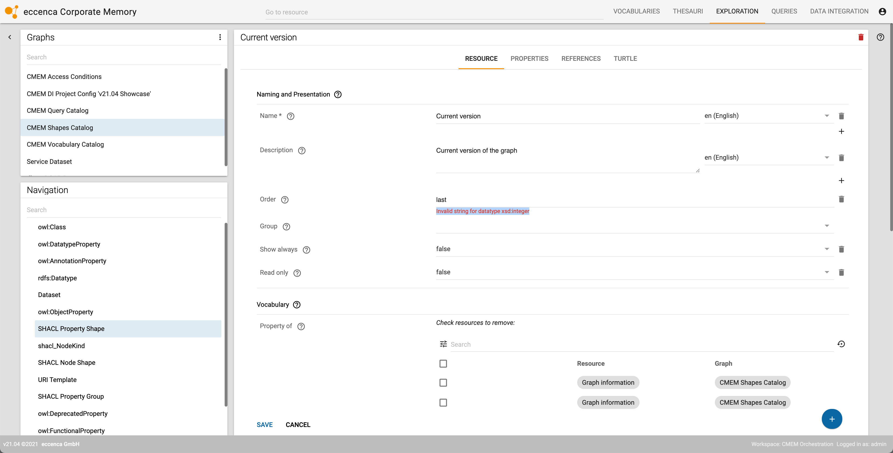
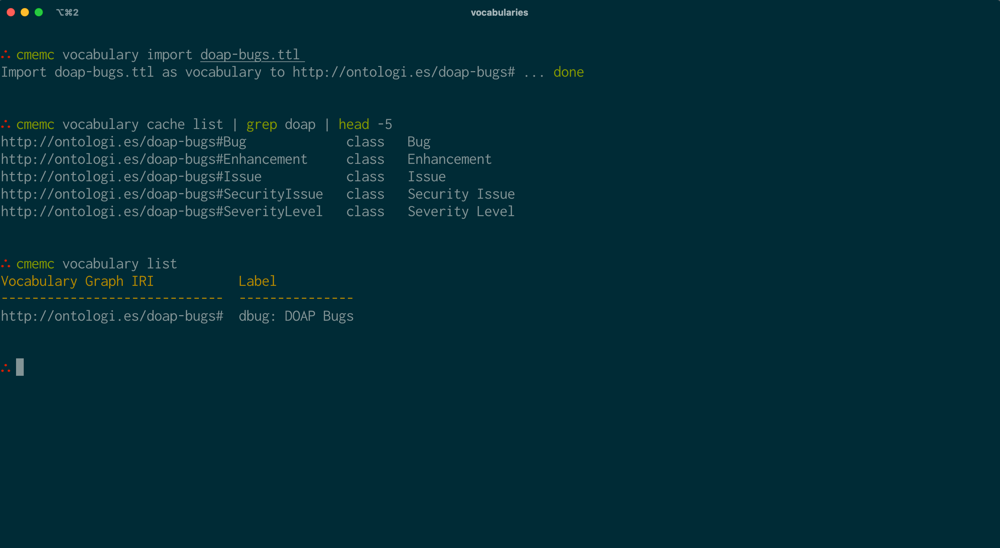

---
tags:
    - ReleaseNote
---
# Corporate Memory 21.04

Corporate Memory 21.04 is the second release in 2021.

The highlights of this release are:

- Build: The mapping editor now allows for auto-completion of paths on any level in multi-hop paths, including source type specific paths with special semantics, e.g. `#idx` for CSV datasets. This feature lowers the barrier for new Corporate Memory users and allows for much master mapping creation.
- Explore: Manual authoring of resources via SHACL-shape based [customized user interfaces](../../explore-and-author/graph-exploration/building-a-customized-user-interface/index.md) is now supported with client-side datatype validation (in addition to store-based validation). This feature provides instant user feedback while typing Literals and therefor allows faster data entry.
- Automate: The new vocabulary import command of cmemc adds a turtle file as a vocabulary to Corporate Memory (upload and create catalog entry). This allows for automation of CI/CD pipeline which depend on vocabularies managed in a Git Repository.

!!! warning

    With this release of Corporate Memory the DataIntegration and DataManager configuration as well as cmemc command behavior has changed and have to be adapted according to the migration notes below.

This release delivers the following component versions:

- eccenca DataPlatform v21.04
- eccenca DataIntegration v21.04
- eccenca DataManager v21.04
- eccenca Corporate Memory Control (cmemc) v21.04

More detailed release notes for these versions are listed below.

## eccenca DataIntegration v21.04

This version of eccenca DataIntegration adds the following new features:

- A new mapping parameter enables the user to specify whether single or multiple values are written by a particular mapping:
    - Supported by both value and object mappings.
    - Replaces the "is Attribute" parameter on value mappings, which has been specific to XML.
    - Generates a validation error if multiple values are written if single values are configured.
    - Datasets may adapt the written schema based on the chosen option (see help text in mapping editor).
- Improved auto-completion value path mapping field:
    - Allows auto-completion of paths on any level in multi-hop paths.
    - Supports auto-completion of properties inside of property filters.
    - Proposes data source specific paths with special semantics, e.g. `#idx` for CSV.
    - Validates the syntax of the value path and highlights errors to the user.
- Tasks can be copied between projects.
- A new transform task parameter (`abortIfErrorsOccur`) specifies whether the execution will fail if a validation error occurs.
- Added URI literal type for writing `xsd:anyURI` values to Knowledge Graphs.
- Added option for "Regex extract" transformer for extracting all matches.

In addition to that, these changes are shipped:

- Support editing of auto-completed values in mapping editor.
- Mapping editor auto-complete element:
    - Support editing of auto-completed values.
    - added support for multi-word search highlighting.
    - Show label and value of the selected value, e.g. label and URI for target property.
- Improvements to execution reports
    - Added an overview section, which displays general information about the execution:
        - Final workflow status
        - Start, finish and cancellation times
        - Users account which started and canceled (if any) the execution
    - All operator executions are persisted. For instance, workflow reports will contain separate task reports for writing and reading a dataset.
    - For each operator execution, an optional operation label can be shown (e.g., read, write, generate queries).
    - The order of the task reports is stable now and reflects the order of execution.
    - Added a scrollbar to the task list, if it is too large to be displayed.
- Improved JSON writing support:
    - A rewritten implementation supports arbitrarily large JSON files by using a memory-mapped key-value store.
    - An optional template may be specified to customize the written JSON.
    - Values are only wrapped in JSON arrays if the multiple value option is set in the mapping.
- Transform Evaluation now shows evaluation of the URI rule.
- Improved workflow saving:
    - On loading, the save button is only enabled after the workflow has been loaded to prevent the user from saving an empty workflow.
    - A spinner is shown while the workflow is saved.
    - The save button is disabled while the workflow is saved.
    - A confirm dialog is shown, if the user tries to leave while a save is in progress.
- The behavior of linking rules in case of missing values has been improved:
    - The `required` attribute has been removed, because it has lead to unexpected and sometimes inconsistent behavior.
    - Boolean aggregators have been reworked to interpret missing values as false.
    - The "Handle missing values" aggregator has been added to handle cases in which missing values should default to a user specified score (For instance, if missing value should be interpreted as true).
    - The "Default value" transformer has been added to generate default values for missing values.
- Improved inline documentation using markdown rather than text description.
- Workflow progressbars now show the task labels instead of their internal identifiers.
- Page header contents are now created directly in the artifact view templates instead being an independent component pulling all information via holistic approach.

In addition to that, multiple performance and stability issues were solved.

## eccenca DataManager v21.04

This version of eccenca DataManager adds the following new features:

- Shacl
    - Add datatype validation for all supported datatypes
- Configuration
    - Add a configurable link to account settings in keycloak:
        - `js.config.modules.accountSettings.enable: true`
        - `js.config.modules.accountSettings.url: http://docker.local/auth/realms/cmem/account/?referrer={{REFERRER}}&referrer_uri={{REFERRER_URI}}`
    - General
        - Global error handling to display errors preventing most grey screens

In addition to that, these changes are shipped:

- General
        - Use redux store to manage notifications in DataManager (MessageHandler) and improve error parse / handle
        - Use redux store to manage main application state.
        - Change value of `js.config.modules.explore.overallSearchQuery` and `js.config.modules.explore.navigation.searchQuery` to use the `""""` SPARQL string separator.
        -   *BREAK* please use `"""` if you use custom queries for that values
- Development
    - Switch to GUI elements repository from Github

In addition to that, multiple performance and stability issues were solved.

## eccenca DataPlatform v21.04

These followin changes are shipped:

- General
    - Virtuoso is now using the custom build-in function to list graphs faster.
- Bootstrap Data
    - ucum removed as default vocab in the vocabulary catatog
    - qudt added as a default vocab in the vocabulary catalog
    - all vocabularies are provided via [download.eccenca.com](https://download.eccenca.com/ontologies/) now

In addition to that, multiple performance and stability issues were solved.

- Health Endpoint
    - race condition in the health condition that leads to rare cases of wrongly reporting DOWN
- HTTP Connection Pool
    - size increased to increase parallelism and resilience
- Statement-Level Metadata
    - works now on inverse properties
- Graph List
    - incorrect type statements are ignored

## eccenca Corporate Memory Control (cmemc) v21.02

This version of cmemc adds the following new features:

- new `config get` command
    - get the value of certain configuration key (such as `DP_API_ENDPOINT`)
- new `dataset open` command
    - similar to the other open commands, opens a dataset in the browser
- `graph export` command
    - `--mime-type` option added to specify requested mime type
    - the default mime type is still `application/n-triples`
- new `vocabular import` command
    - Import a turtle file as a vocabulary (upload and create catalog entry)
- `project export` command
    - `--extract` option added in order to export projects to directories
    - `--help-types` option added to get a list of export formats
- `project import` command
    - add support for importing projects from extracted directories
    - add `--overwrite` option to import files/directory to an existing project

In addition to that, these changes are shipped:

- default values for `OAUTH_USER` and `OAUTH_PASSWORD` is `None` except for grant type password
- docker base image forwarded to `debian:stable-20210408-slim`
- `graph export` command
    - does not load the result in memory anymore but stream the result to the file
- `graph import` command
    - does not load the payload in memory anymore but stream it to the endpoint
- `project export` command
    - command now fails early if a non-existing project is requested
- `project create` command
    - command now fails early if a project is already there
- `project delete` command
    - command now fails early if a non-existing project is requested
- `project import` command
    - now uses the new project import API
- removed reference to config keys
    - `CMEM_BASE_PROTOCOL` and `CMEM_BASE_DOMAIN` were never used
- remove `workspace` command group from root
    - was in 21.02 deprecated
    - now removed from root and available as `admin workspace` command group
- fix: `project export` command
    - command now fails correctly with exit code 1 if a non-existing project is requested
- fix: `project import` command
    - command now fails correctly with exit code 1 in case of an import to an existing project

## Migration Notes

### DataIntegration

- The behavior of linking rules in case of missing values has been changed:
    - Now, boolean aggregations (AND, OR) interpret missing values as "false".
    - Non-boolean aggregations will returns "-1" if values for at least one input are missing.
    - If another behavior is expected, the "Handle missing values" aggregation or the "default value" transformer can be used in both cases.

### DataManager

- To allow special characters to be search in `js.config.modules.explore.overallSearchQuery` and `js.config.modules.explore.navigation.searchQuery`, use `""""` instead of just `"` to delimitate strings with search placeholders.
e.g: `regex(str(?resource),"{{QUERY}}","i")` should be written as `regex(str(?resource),"""{{QUERY}}""","i")`

### DataPlatform

No migration notes

### cmemc

- The exit code values of `project import` and `export` commands are fixed (in case of failure) so you may have to change these calls in your scripts.
- The deprecated `workspace` command group is now only available as `admin workspace` command group so you have to change these calls in scripts.

