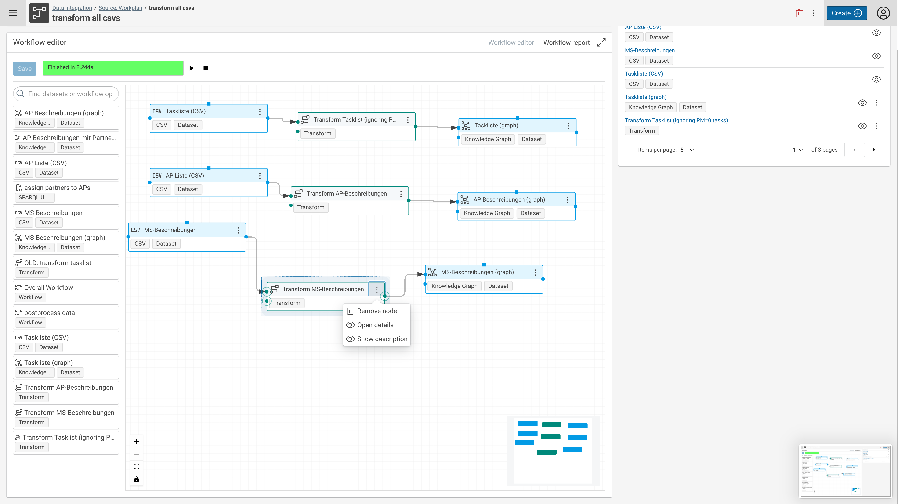
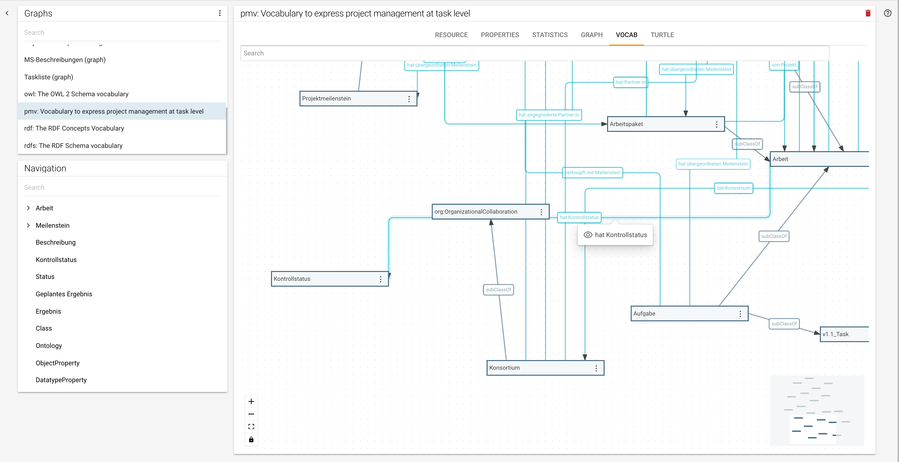

---
tags:
    - ReleaseNote
---
# Corporate Memory 21.06

Corporate Memory 21.06 is the third release in 2021.






The highlights of this release are:

- Build: The Data Integration workflow editor got a complete remake based on a more flexible and better extensible drawing engine. Workflow tasks use the same icons and tags from the workspace now and are better integrated in the build user interface.
- Explore: The new Data Manager vocabulary viewer visualises classes and its relations (subclasses, domain/range relations) from an installed vocabulary.
- Automate: cmemc is now able to fetch credentials from external processes in order to integrate with company wide or personal password infrastructure.

!!! warning

    With this release of Corporate Memory the DataIntegration and cmemc configuration and behaviour has changed and have to be adapted according to the migration notes below.

This release delivers the following component versions:

- eccenca DataPlatform v21.06
- eccenca DataIntegration v21.06.1
- eccenca DataManager v21.06.3
- eccenca Corporate Memory Control (cmemc) v21.06

More detailed release notes for these versions are listed below.

## eccenca DataIntegration v21.06.1

This version of eccenca DataIntegration adds the following new features:

- New workflow editor:
    - Completely rewritten workflow editor that replaces the old editor.
    - The old workflow editor can be re-enabled by setting the following configuration value: `workbench.tabs.legacyWorkflowEditor = true`.
    - Added API endpoint to fetch workflow node (input) port configurations.
- Enable the creation and execution of nested workflows.
    - Workflows can be nested within other workflows.
    - Nested workflow reports can be viewed in the execution report.
    - Already nested workflows cannot be used in other nested workflows to protect from too complex projects.
- Added script transform operators
    - Python and Scala are supported as scripting languages.
    - Need to be enabled in the configuration.
- Template transform operator.
- Synonym-based mapping suggestion
    - Added global vocabulary synonym cache that extracts synonyms for vocabulary properties from existing mapping rules.
    - Use synonyms in mapping suggestion so more properties can be suggested to the user based on existing mapping rules that map similarly named attributes/properties.
    - Config parameters:
    - `mapping.suggestion.features.extractSynonymsFromExistingMappingRules.enabled`: Enables the synonym based mapping suggestion. Default: `true`
    - `mapping.suggestion.features.extractSynonymsFromExistingMappingRules.timeBetweenRefreshes`: The minimum time in milliseconds between synonym cache refreshes. Default: 10 seconds
    - `mapping.suggestion.features.extractSynonymsFromExistingMappingRules.waitForCacheToFinish`: The max. time to wait for a new cache value during a mapping suggestion request if the current value has gotten stale. Default: 50ms
- New OpenAPI based documentation of HTTP API:
    - Replaces the previous RAML-based documentation.
    - Can be viewed live in the UI at `{DI_URL}/doc/api`.
- New Neo4j dataset, which supports writing into Neo4j graphs and reading them back.
- Coalesce transform operator that forwards the first input that has any value/s.
- Add concrete item type, e.g. 'CSV' or 'Transform', to search result and recently viewed items and make it searchable.
- Add tooltip to search item if item description is too long to show in a single line.

In addition to that, these changes are shipped:

- Mapping suggestion improvements:
    - Support source path column filters: show only already mapped source paths, show only unmapped source paths.
    - Do not show filters in from-vocabulary view that cannot be applied, e.g. show auto-generated only.
    - Shortened source paths are shown as tooltip in full length on hover.
    - Show source path type (data type or object) in source info box.
    - For object source paths show their direct sub-paths.
    - Improve error reporting in mapping suggestion and mapping rule example view.
- Prefix management improvements:
    - Validate prefix name and value in the UI
    - Ask before updating existing prefix names. Also change button to 'Update' when prefix name matches an existing prefix.
- Allow object rule mappings with empty target property and non-empty source path in order to change the source resource, but stay on the target resource.
- The configuration of plugins (in particular the blacklist) has been improved.
    - Plugin configuration has been grouped under a common root
    - Plugins can be enabled/disabled individually
    - See breaking changes for details
- E-mail operator extensions and improvements:
    - Allow to send multiple e-mails with different configurations (from, to, subject, content, cc, bcc).
    - Add e-mail execution report
    - Add retry mechanism
- XML dataset (streaming mode):
    - Allow property filters on attributes in object paths
- The RDF file dataset now autocompletes formats.
- Centralized error handling.
- Upgrade to Play 2.8.
- (21.06.1) Added a retry mechanism if connections on S3 are interrupted (CMEM-3675)
    - Per default, at most 10 retries are attempted.
    - Number of retries can be changed by setting the configuration parameter `retryCount` (available on `workspace.repository.s3` and `workspace.repository.projectS3`).

In addition to that, multiple performance and stability issues were solved.

## eccenca DataManager v21.06.5

This version of eccenca DataManager fixes the following issues:

- Linkrules
    - several stability improvements for GraphDB backends
- Explore
    - New Vocabulary Visualization Component to the graph explore view.

In addition to that, these changes are shipped:

- Vocabs
    - Show spinner during installing/uninstalling vocab
    - Install new vocabularies failed if preferredNamespace is not defined.
- ObjectView
    - Render images without knowing the relation by parsing the value. Images are provided as URI: `<data:image_svg+xml......>`
- Linkrules
    - Fix of missing dcterms prefix in a query
    - Fix of the publish/unpublish query
    - Restore Joint.js common styles
    - A warning about saving published rule should be shown once
    - Layout position is preserved for newly added operators
    - Evaluation is presented inline without conflicting with the manual placement
    - Empty text fields are no longer reset to the placeholder value
    - wrong order of selection items in templates
    - ID generation for operators, in case multiple prototypical pipelines are presents
    - Link Rules Type Error
    - Failed DI calls not catched in DM
    - Broken visual connection after evaluation in LinkRuleEditor
- General
    - prevent errors in login
    - Bearer Token not persistent
    - DM Query fails because endpoint id and token are not set
- Query
    - Search in labels does not work

In addition to that, multiple performance and stability issues were solved.

## eccenca Corporate Memory Control (cmemc) v21.06

This version of cmemc adds the following new features:

- `graph import` command
- new option `--skip-existing` will not touch graphs which are already there
- `admin token` command
    - new option `--decode` shows content of the decoded auth token
    - in combination with `--raw` it outputs the decoded token as json
- configuration
    - new configuration keys to fetch credentials from external processes
    - use the parameter `OAUTH_PASSWORD_PROCESS`, `OAUTH_CLIENT_SECRET_PROCESS` and `OAUTH_ACCESS_TOKEN_PROCESS` to setup an external executable

In addition to that, these changes are shipped:

- docker base image is now `debian:stable-20210721-slim`
- support for `OAUTH_PASSWORD_ENTRY` and `OAUTH_CLIENT_SECRET_ENTRY` removed
- fix: freeze click dependency to 7.1.2

## Migration Notes

### DataIntegration

- All script operators are disabled by default now and need to be re-enabled by configuration.
- The (not-working) spotlight transform operator is disabled by default now.
- Optional: When loading existing workflows in the new workflow editor, the operators might overlap and may need to be re-arranged manually.
    - This does not influence the actual execution of the workflows in any way.
    - An auto-layouting feature will be added in the future
- Plugin configuration has been changed. The 'plugin.blacklist' has been deprecated and will be removed in future versions. See example below for new format:
```
pluginRegistry {
  # External plugins are loaded from this folder
  pluginFolder = ${elds.home}"/etc/dataintegration/plugins/"

  # Configuration of individual plugins.
  plugins {
    pluginId1.enabled = false
    ...
  }
}
```

### DataManager

No migration notes

### DataPlatform

No migration notes

### cmemc

- The configuration keys `*_ENTRY` are not supported anymore. In case you used them, switch to `*_PROCESS` configuration


