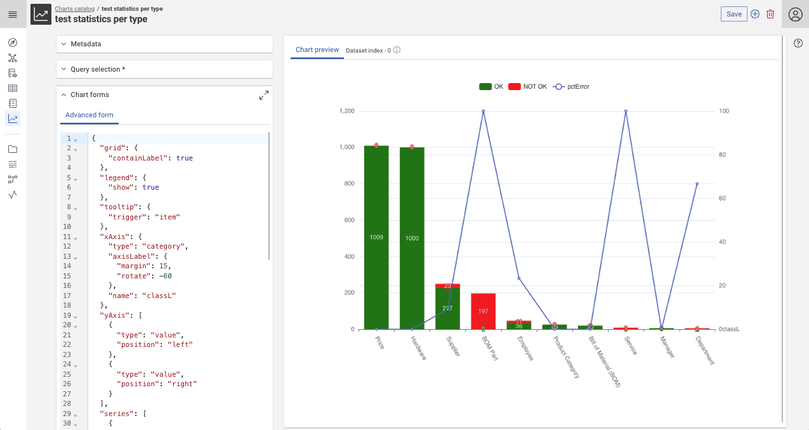
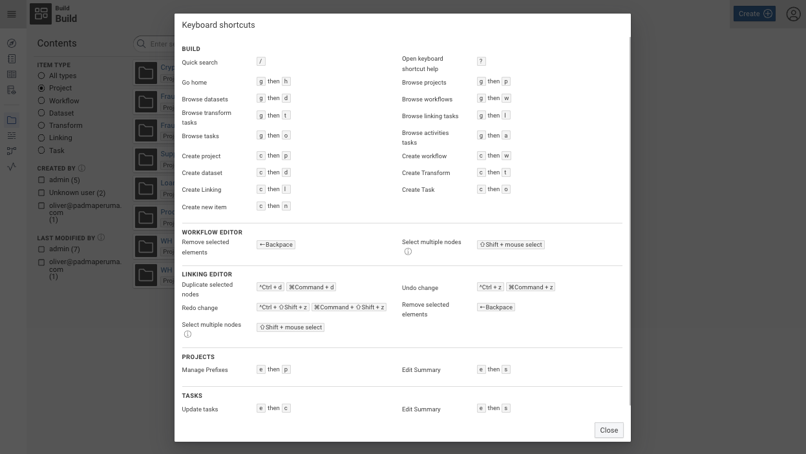
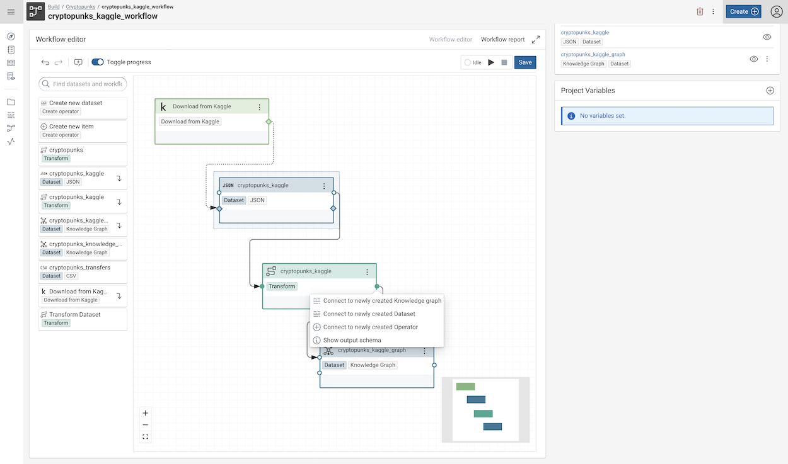

# Corporate Memory 23.3.0

Corporate Memory 23.3.0 is the third main release in 2023.

{ class="bordered" }
{ class="bordered" }
{ class="bordered" }

The highlights of this release are:

-   Explore and Author:
    -   new **[charts catalog](../../explore-and-author/charts-catalog/index.md)** module added, which allows for defining BI widgets / charts which can be integrated into shapes
    -   preview release of our generative AI / LLM based **Ontology and Query Assistant**
-   Build:
    -   operate BUILD like never before by using the new **keyboard shortcuts** (press "?" in the build module to learn the details)
    -   several **improvements to the workflows view**: create new datasets and other workflow-operators in place, dependencies and execution order is now explicitly modelled, show schema or ports
-   Automate:
    -   new **`project variable` command group** plus several addition to existing commands

This release delivers the following component versions:

-   eccenca DataPlatform v23.3.0
-   eccenca DataIntegration v23.3.0
-   eccenca DataManager v23.3.0
-   eccenca Corporate Memory Control (cmemc) v23.3.0

More detailed release notes for these versions are listed below.

## eccenca DataIntegration v23.3.0

We're excited to bring you the latest update to DataIntegration v23.3.0, featuring numerous enhancements, bug fixes, and deprecations.

v23.3.0 of eccenca DataIntegration adds the following new features:

-   plugin base library updated to v4.3.0 ([changelog](https://github.com/eccenca/cmem-plugin-base/blob/main/CHANGELOG.md))
-   Support for custom plugin icon.
-   New `distinct by` Workflow operator that removes duplicated entities based on a user-defined path.
-   Endpoint to download the DataIntegration vocabulary.
-   Mappings allow custom target types
    -   If the new custom data type is selected, a new input field _type_ allows the user to enter a type URI.
-   Added variables widget to Workflow view.
-   Added hotkey access to actions in DI workspace.
-   Workflow editor:
    -   Validate ports and connections and show warnings for found issues.
    -   Have menu option to show input/output schema for ports that either expect or output a fixed schema.
    -   Support dependency connections between workflow nodes to specify non-data execution dependencies.

v23.3.0 of eccenca DataIntegration introduces the following changes:

-   The threshold field for distance measures has been improved:
    -   For boolean distance measures, the threshold is not shown as it has no effect.
    -   For normalized and unbound measures, the range of allowed values as well as an improved tooltip has been added.
    -   A error message is shown if the entered threshold is not valid for the given distance measure.
-   Parse JSON operator now works with multiple entities.
-   Updating or deleting project variables will update all affected tasks transactionally:
    -   The user is not allowed to delete a variable that is used in a task parameter template.
    -   The user is not allowed to change a variable to a value that violates restrictions in a task that uses it
        -   If the task parameter has a specific type (such as integer) and the template now evaluates to an incompatible type.
        -   If the task imposes other restrictions on a parameter (for instance, does not allow values below 0).
-   base image switch to bookworm (python:3.11-slim-bookworm)
-   If a path uses a property filter, an error will be thrown on writing data to a Knowledge Graph, if the property is not a valid URI.
-   Support expanding all rule trees after expanding all rows in the transform evaluation.
-   Change input ports definition of `Upload File to Knowledge Graph` operator from an empty fixed schema to variable inputs to make it better compatible.
-   Transform page: When switching between tabs, e.g. from mapping editor to evaluation tab, the currently active rule stays active.
-   JSON `#text` path now returns the formatted JSON as documented.

v23.2 of eccenca DataIntegration ships the following fixes:

-   Project variables widget showing the variables of the wrong project.
-   Python package uninstall is not able to remove crucial packages anymore.
-   Reload failed tasks after project/workspace reload.
-   Reloaded failed tasks are missing the original label and description.
-   Fix property pair alignment.
-   Hotkey and quick search modal are not always shown on top of other modals.
-   Testing for invalid documents downloaded from GDocs fixed and adapted to new behavior of wrong requests.
-   Error message in 'SPARQL endpoint' plugin to mention prohibited URL redirect to a different protocol.
-   `JDBC endpoint` dataset: Setting the user via JDBC URL while leaving the user parameter blank does not work.

## eccenca DataManager v23.3.0

We are excited to announce the latest update to DataManager v23.3.0, which introduces new features, improvements and bug fixes.

v23.3.0 of eccenca DataManager adds the following new features:

-   Implemented Charts module with Shacl integration.
-   Added option to show edges without the shapes on the EasyNav canvas and in the sidebar, i.e. the node expansion is still shaped.
-   Query module allows simple query creation with an form assisted dialogue.

v23.3.0 of eccenca DataManager ships the following changes:

-   Internal:
    -   Query module is migrated from Redux to a Context storage.
    -   Query module is extracted to a separate common component.
-   ResourceSelect doesn't request options anymore if they have already been requested earlier.
-   `shui:listQuery` allows usage of the `{{username}}` placeholder, which is replaced by the name (i.e.not the IRI) of the logged in user.

v23.3.0 of eccenca DataIntegration ships the following fixes:

-   Fixed broken navigation (workspace part of URL was lost).
-   CMEM Manual Testing 23.2 e2e - Don't do redundant redirects in the Module context.
-   Navigation tree in the Thesaurus module was collapsed after a subitem select.
-   Use more space for visualization catalogue if available.

## eccenca DataPlatform v23.3.0

We're excited to bring you the latest update to DataPlatform v23.3.0, featuring numerous enhancements, bug fixes, and deprecations.

v23.3.0 of eccenca DataPlatform ships following fixes:

-   Fixed non-working query cancelling in GraphDb 10.3
-   Wrong caching on facet query calls

v23.3.0 of eccenca DataPlatform adds the following new features:

-   Added endpoint for removal of system resources i.e. bootstrap data
-   GraphDb embedded development build

v23.3.0 of eccenca DataPlatform ships the following changes:

-   Dataplatform health check update:
    -   activation of spring boot kubernetes health groups `liveness/readiness`.
    -   creation of health group `sparql` which can be (de)activated:
        -   `management.health.sparql.enabled`: (De)activates check from DP to store backend (default: true).
        -   `management.health.sparql.fixedDelayInMilliseconds`: delay in ms between store checks (default: 5000).
        -   `management.health.sparql.timeoutInMilliseconds`: timeout on how long to wait for store to answer check request (default: 5000).
    -   health group `sparql` contributes to readiness state / overall health endpoint.
    -   Graphdb health check uses Gdb endpoint for repository.
-   Charts configuration API and Shacl integration.
-   Breaking change: remove property `authorization.abox.prefix` (fixed default: <http://eccenca.com/>).
-   Workspace configuration adjustments:
    -   `Application presentation` added properties companyName, applicationName, bannerBackgroundColor.
    -   `EasyNav module` added property shapePropertyView.
    -   Chart configuration module.
    -   Change default system workspace values.
-   Spring Boot v3.1.x

## eccenca Corporate Memory Control (cmemc) v23.3.0

We're excited to bring you the latest update to Corporate Memory Control (cmemc) v23.3.0, featuring numerous enhancements, bug fixes, and deprecations.

v23.3.0 of eccenca Corporate Memory Control adds the following new features:

-   `project variable` command group
    -   `create` command - create a new project variable
    -   `delete` command - delete a project variable
    -   `get` command - get the value or other data of a project variable
    -   `list` command - list available project variables
    -   `update` command - update data of an existing project variable
-   `admin workspace python` command group
    -   `open` command - open a package pypi.org page in the browser
    -   `list --available` option - list published packages
    -   `uninstall --all` option - reset the whole python environment
-   `project` command group
    -   `create --label` option - give a label for the created project
    -   `create --description` option - give a description for the created project
-   `dataset` command group
    -   `update` command - update the configuration of an existing dataset
-   `workflow` command group
    -   `execute --progress` option - show a progress bar
-   `admin store` command group
    -   `bootstrap --remove` option - delete the bootstrap data

v23.3.0 of eccenca Corporate Memory Control introduces the following changes:

-   `workflow execute` command - more debug info when polling for workflow info
-   Upgrade to `click` v8 (see Migration Notes).
-   Upgrade to debian 12 based image: `3.11.6-slim-bookworm`

## Migration Notes

!!! warning

    We do not guarantee forward compatibility for configuration, data or projects.
    I.e. importing a project created with DataIntegration v23.2 into DataIntegration v23.1 (or older) might not work.

    Backward compatibility will be ensured or migration paths explained.
    I.e. projects created with DataIntegration v23.1 can be imported into DataIntegration v23.2.

### DataPlatform

Due to the removal of the `authorization.abox.prefix` configuration option, a change in your setup may be required.

!!! warning

    Even if you have not changed this value (to anything other than `http://eccenca.com/`), please remove the `authorization.abox.prefix` configuration property from your DataPlatform `application.yml`. This property must be absent or DataPlatform will not start.

From v23.3 `AccessCondition`s are only regarded if their IRIs use the prefix `http://eccenca.com/` (e.g. have an IRI like `http://eccenca.com/170f25c2-3b92-40d7-b247-5bba42dbe22a`). Required action:

-   If you have been using a different prefix for your `AccessCondition`s, change the prefix of these resources. E.g. by:
    -   search / replace the old prefix with the new one in your RDF graph backup
    -   using a `SPARQL query` like:

        ```sql
        PREFIX eccauth: <https://vocab.eccenca.com/auth/>

        INSERT {
            GRAPH <urn:elds-backend-access-conditions-graph> {
                ?new_acl a eccauth:AccessCondition .
                ?new_acl ?p ?o .
            }
        }
        WHERE {
            # this Graph IRI corresponds to your `authorization.abox.accessConditions.graph` configuration
            # default <urn:elds-backend-access-conditions-graph>
            GRAPH <urn:your-custom-namespace> {
                ?acl a eccauth:AccessCondition .
                ?acl ?p ?o .
                BIND(IRI(REPLACE(STR(?acl), "urn:your-custom-prefix", "http://eccenca.com/")) AS ?new_acl)
            }
        } ;
        ```

### cmemc

-   The upgrade to `click` v8 involves new completion functions (see [completion manual](../../automate/cmemc-command-line-interface/configuration/completion-setup/index.md))
    -   Old: `_CMEMC_COMPLETE=source_zsh cmemc`
    -   New: `_CMEMC_COMPLETE=zsh_source cmemc`
