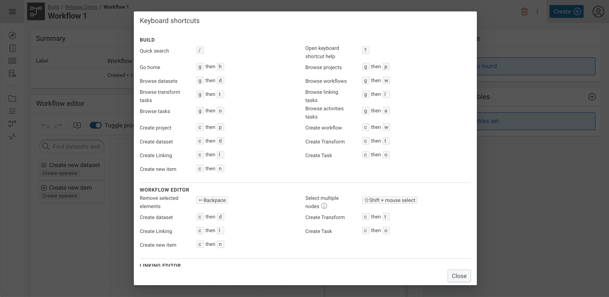
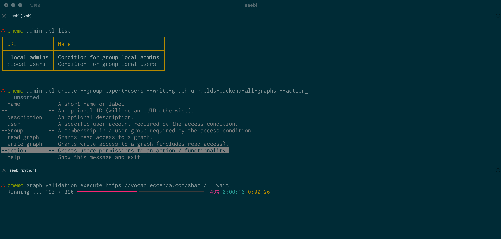
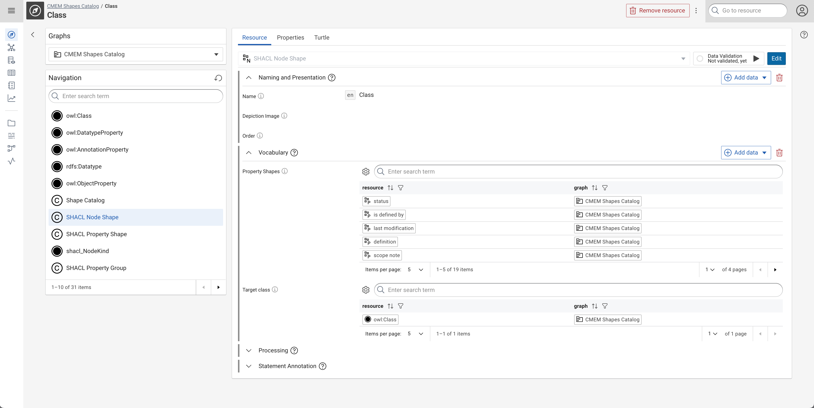

# Corporate Memory 24.1.0

Corporate Memory 24.1.0 is the first release in the 24.1 release line.

{ class="bordered" }
{ class="bordered" }
{ class="bordered" }

The highlights of this release are:

-   Build:
    -   New improved **REST operator** (v2) with lots of additional features
    -   Extendend **Keyboard Shortcuts** in workflow editor
-   Automate:
    -   New **`admin acl` command group** to automate management of access conditions
    -   New **`graph validation` command group** to automate batch validation of graph resources against SHACL shapes
-   Explore and Author:
    -   Preview of our new **SHACL Authoring Engine** (enable with feature flag `shacl2` on your workspace configuration: `Basics`>`Workspace`>`featureFlags`)

This release delivers the following component versions:

-   eccenca DataIntegration v24.1.0
-   eccenca DataManager v24.1.0
-   eccenca DataPlatform v24.1.0
-   eccenca Corporate Memory Control (cmemc) v24.1.0

More detailed release notes for these versions are listed below.

## eccenca DataIntegration v24.1.0

We're excited to bring you the latest update to DataIntegration v24.1.0, which introduces new features, improvements and bug fixes:

v24.1.0 of DataIntegration adds the following new features:

-   Multiline editing of template values
-   Added loose connection of workflow nodes similar to linking editor
-   XML, JSON, Excel and CSV datasets support retrieving the line and column numbers
-   Error report for (validation) errors in transform and linking rule editors and transform execution report
    -   Shows additional details like a stacktrace and input values
-   Added hotkey integration for creating new items in the workflow editor
-   Improved REST operator (v2)
    -   With support for multiple REST requests, one per input entity
    -   Paging support: If the API does not return all results in a single request, this features allows to page via multiple requests and merge the results of all requests
    -   Better error handling and retry mechanism: Retries requests and collects errors for execution report
    -   Rate limiting of requests by setting a delay between subsequent requests
    -   Limit and offset: Only executes a specific "window" of the input entities/requests
    -   URL property: Allows to define a property that is injected into the result JSON that contains the original request URL
    -   Support dataset file output, i.e. a file based dataset can be connected to the operator output, which overwrites the dataset file with the results from the REST requests
      -   This allows to handle REST results as any dataset content
      -   Supports zip files. If a dataset (currently JSON, XML, RDF file, CSV) specifies a zip file (ending in .zip) a zip archive is written that contains one file per request result
-   JSON dataset
    -   Support bulk resources, i.e. JSON files in a zip file
    -   Support reading JSON Lines files
-   Python workflow plugins can now consume and produce hierarchical entities
-   Additions to the workflow configuration ports:
    -   Allow to reconfigure transform and linking tasks in workflows
    -   Datasets can be connected directly to the configuration port
-   Extended auto-completion support when opening the mapping (rule) editor in a workflow context:
    -   Support auto-completion of target properties for fixed target schema and config port schema (transformation connected to config port)
    -   Support auto-completion of values paths for fixed input schema
-   Added timer for workflow execution and in activity view
-   Error notification
    -   Add badge to error notification menu icon with error count.

v24.1.0 of DataIntegration introduces the following changes:

-   Show project variables re-ordering errors (with details) directly in project variables widget
-   Support PATCH and DELETE requests in REST operators
-   Upgraded libraries, in particular Play to v2.9.1 and Spark to v3.5.0
-   Support of custom tasks as input for transform and linking tasks
-   Create/update dialogue:
    - When a parameter value is changed that other parameters are depending on, those parameter values are reset because they might not be valid anymore
-   Shortened workflow execution failure message shown in activity widget
-   Added `Fail workflow` flag to `Cancel workflow` operator

v24.1.0 of DataIntegration ships the following fixes:

-   Many errors occurring in a form/modal, e.g. from requests, are hidden because they are shown in the global error notification which cannot be accessed while the form is open
-   Missing or problematic error handling in several forms and other places
-   Transform editor should show plugin labels instead of ids
-   Transform execution report validation icons in mapping tree do not update after running the execution
-   When upgrading a plugin, new parameters are not shown in transform editor
-   Workflow editor: Creating a new connected task that has no input port connects to the output port
-   Copying a project with custom prefixes into a project that misses these prefixes fails
-   Workflow report always states `...has not finished execution yet.`
-   Cannot add a new project variable after having tried to add it with an empty value
-   Support for ARM64 architecture
-   View completely crashes when error is not caught in any tab view (plugin) - there should be an error boundary
-   Mapping editor shows spinner when no network is available when switching to it
-   Linking editor does not load when network unavailable instead of showing error

## eccenca DataManager v24.1.0

We are excited to announce the latest update to DataManager v24.1.0, which introduces new features, improvements and bug fixes:

v24.1.0 of DataManager adds the following new features:

-   License warnings for Corporate Memory and GraphDB license
-   Added validation for invalid URI format in vocabulary registration form
-   SHACL2 (beta feature, disable per default)
    -   support for literals
    -   support for object properties
    -   validation
    -   context graph
-   SVG support for the object view
-   A link to the DataPlatform API documentation

v24.1.0 of DataManager ships the following changes:

-   Explore Navigation Component, now supports depictions and pre-loading of the concepts list
-   I18N
    -   Increased coverage
    -   Enabled nesting of the keys in translations
    -   Improvements in the application header in explore

v24.1.0 of DataManager ships the following fixes:

-   Security Update of Java wrapper
-   Workspace selection resets module selection
-   Considering `exploreModuleConfiguration.defaultGraph` during the Explore module mount
-   Added navigation blocker for the EasyNav module
-   Keeping EasyNav viewport parameters during visualization save
-   Installing a vocabulary now fully refreshes the application state
-   Workspaces, which are prefix of an other workspace, are now correctly handled

## eccenca DataPlatform v24.1.0

We're excited to bring you the latest update to DataPlatform v24.1.0, which introduces new features, improvements and bug fixes:

v24.1.0 of DataPlatform adds the following new features:

-   Add license information to DataPlatform actuator info endpoint response
-   Added endpoints for SHACL validation / Resource shaping
    -   SHACL validation and resource shaping
        -   endpoints for validation, node shape structure views and data retrieval
    -   SHACL batch validation
        -   added application property `scheduler.backgroundQueryPoolSize` (Default: 4)
            -   maximum numbers of threads for background jobs (i.e. SHACL batch validation)
        -   added application property `proxy.shaclBatchResultsMemoryBoundaryInMb` (Default: 100)
            -   amount in Megabytes (Mb) for SHACL batch validation results kept in memory for status retrieval
-   Access condition review endpoint
    -   ability to check user rights (access conditions) for a set of groups

v24.1.0 of DataPlatform ships the following changes:

-   Static access condition prefix split for newly created access conditions
    -   `<http://eccenca.com/>` – prefix for Access Condition Groups / Users
    -   `<http://eccenca.com/ac/>` – prefix for Access Conditions
-   Added tracing id to audit logs
-   Add feature flag field to workspace configuration
-   Add support for GraphDB 10.5

v24.1.0 of DataPlatform ships the following fixes:

-   Allow blank nodes in update queries
-   API endpoints do not return `null` values for unset fields anymore
-   Correct documentation of API endpoints for named query execution
-   Default language order is changed to: `["en", "", "de"]`


## eccenca Corporate Memory Control (cmemc) v24.1.0

We're excited to bring you the latest update to Corporate Memory Control (cmemc) v24.1.0, which introduces new features, improvements and bug fixes:

v24.1.0 of Corporate Memory Control (cmemc) adds the following new features:

-   Added support for importing vocabulary from standard input (`stdin`)
-   `admin acl` command group
    -   `create` command - Create an access condition
    -   `delete` command - Delete access conditions
    -   `inspect` command - Inspects the access condition
    -   `list` command - List all access conditions
    -   `review` command - Reviews the graph rights for a given access condition
    -   `update` command - Updates an access condition
-   `graph validation` command group
    -   `execute` command - Start a validation process
    -   `inspect` command - Inspect validation process results
    -   `list` command - List validation processes
    -   `cancel` command - Cancel a running validation process
-   `admin user list` command
    -   `--filter` option - filter user list
-   `admin status` command
    -   raises an error if the Corporate Memory license is expired (grace period)
    -   raises a warning if the GraphDB license expires in less than one month
-   `dataset create` command
    -   support to use JSON Lines files as JSON datasets
    -   support to use YAML files as TEXT datasets

v24.1.0 of Corporate Memory Control (cmemc) ships the following changes:

-   `graph import` command
    -   importing a directory to a single graph no longer raises an error but imports all turtle files to this graph
-   docker image: python 3.11.8

## Migration Notes

!!! info

    We do not guarantee forward compatibility for configuration, data or projects.
    I.e. importing a project created with DataIntegration v24.1.0 into DataIntegration v23.3.0 (or older) might not work.

    Backward compatibility will be ensured or migration paths explained.
    I.e. projects created with DataIntegration v23.3.0 can be imported into DataIntegration v24.1.0.

### DataIntegration

There is a known issue and existing workaround with the new dependency port feature: you may receive a message like this when running your workflows:

```
Workflow Execution Error:
Not all workflow nodes were executed! Executed 2 of 7 nodes.
```

In this case, open the affected workflow in DataIntegration and click the save button once (no changes are required).
After saving it will work again.


### DataManager

#### Migrate Default Graph Override

If the default workspace sets a `exploreModuleConfiguration.defaultGraph` but an additional workspace is configured to show graph lists, you might see the following error message:

```
Missing Graph configuration for Context. Please check that the graph
""
actually exists.
```

Previously, un-setting the `exploreModuleConfiguration.defaultGraph` of the default workspace required setting its value to the empty string `""`.
The configuration now follows the standard pattern and expects an explicitly blocked value (i.e. setting it to `null`).
All non-default workspaces that previously set the `exploreModuleConfiguration.defaultGraph` to the empty string `""` need to be migrated by:

1.  Open the workspace in the (workspace) **:material-cog-outline: Configuration**.
1.  Open **Modules** > **Explore**.
1.  Delete the empty `""` value of **defaultGraph** by clicking on the :material-trash-can-outline: icon.
1.  Click on the **block button** to set it to `null`.
1.  **Save** the workspace.


### DataPlatform

DP APIs do not return null values for unset fields anymore.

!!! warning

    Check if null values of non mandatory fields are expected if you are using the DataPlatform APIs with a custom client.


### cmemc

No migrations are required going from cmemc 23.3.x to 24.1.x.

